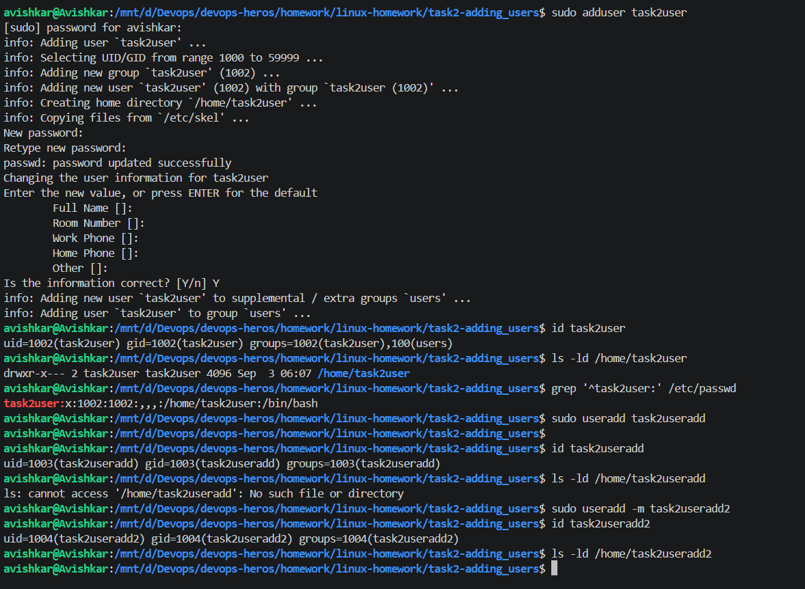

# Task 1: Soft Link and Hard Link

I created an original.txt file and then created both a hard link and a soft link for it.

The main thing I noticed is that the hard link and the original file have the same inode number. This means that both names point to the same file data. Even after I deleted original.txt, I was still able to read the contents using hardlink.txt.

The soft link works differently. It points to the path of the original file, which can be seen as softlink.txt -> original.txt. After deleting original.txt, the soft link stopped working because the file it was pointing to no longer existed.

So, in simple terms, a hard link is another name for the same file, while a soft link is like a shortcut that points to the original file.

> Terminal in `task1-links`. `ls -li` shows `hardlink.txt` and `original.txt` with the same inode and link count 2, while `softlink.txt` has its own inode and points `-> original.txt`.  
> After `rm original.txt`, `cat hardlink.txt` still prints the text but `cat softlink.txt` fails with "No such file or directory". This shows a hard link is a second name for the same data and a soft link is only a path.  

# Task 2: adduser vs useradd

I tried both adduser and useradd to understand the difference between them. When I used adduser, it guided me through the process, asked me to set a password, created a group for the user, and also created the user's home directory automatically. On the other hand, when I used useradd without any options, the user was created successfully, but no home directory was created. I then used useradd -m, where the -m option created the home directory as well. From this, I understood that adduser is more convenient for manually creating users on Ubuntu, while useradd gives more direct control and may require additional options depending on what needs to be configured.

> Output of `sudo adduser task2user` (asks for a password, makes a group, copies `/etc/skel`, creates `/home/task2user`), then `id`, `ls -ld` and `grep` on `/etc/passwd`.  
> Below it, `sudo useradd task2useradd` gives a user with no home directory (`ls -ld` fails), and `useradd -m task2useradd2` creates one. This shows the difference between `adduser` and `useradd`.  

# Task 3: journalctl

I used journalctl to understand how Linux system logs can be viewed and checked. I first viewed the latest system logs and then checked the logs for cron.service using journalctl -u cron.service. This showed me the events and messages related specifically to the cron service. I also used systemctl status cron.service to confirm that the service was running. Finally, I checked the logs from the current system boot. Through this task, I understood that journalctl is useful for checking system and service logs, especially when trying to find warnings, errors, or understand what happened with a particular service.

> `journalctl -u cron.service -n 20` showing the last 20 lines of cron's log, including the stop and the new boot marker.  
> This shows how to read the log of one specific service.  

> `systemctl status cron.service` showing cron as `enabled` and `active (running)` with PID 198, memory and the latest log lines.  
> This confirms the service is up (the status block is printed twice because of the pager).  

> `journalctl -u cron.service -b` showing only cron's log lines from the current boot (13 lines), first in the pager and then as full text.  
> This shows how to limit the log to this boot.  

# Task 4: Commands

I used whoami to check the currently logged-in user. I used grep to search for specific text inside a file. I also used chmod to change the permissions of a shell script and make it executable. Using curl, I made an HTTP request and checked the response from a website. Finally, I used top and htop to monitor the running processes and view CPU and memory usage. This task helped me understand how these commands are used for searching, managing permissions, checking users, making network requests, and monitoring system processes.

> `curl https://example.com` printing the page HTML, `curl -I` printing only the headers (`HTTP/2 200`, `content-type`, `server: cloudflare`), and the first lines of `top`.  
> This shows how to check a website from the terminal.  

> The same `curl` and `curl -I` commands followed by the full `top` output: 32 tasks, CPU all idle, 7783 MiB memory, and the process list.  
> This shows the system load while idle.  

> `htop` with 16 CPU bars at about 0%, memory 451M/7.60G, 33 tasks, and the process list with the F1-F10 menu at the bottom.  
> This shows an interactive view of CPU, memory and processes.  
