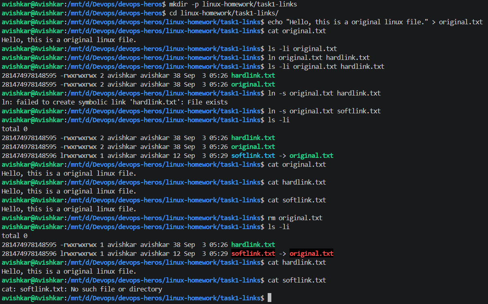

# Task 1: Soft Link and Hard Link

I created an original.txt file and then created both a hard link and a soft link for it.

The main thing I noticed is that the hard link and the original file have the same inode number. This means that both names point to the same file data. Even after I deleted original.txt, I was still able to read the contents using hardlink.txt.

The soft link works differently. It points to the path of the original file, which can be seen as softlink.txt -> original.txt. After deleting original.txt, the soft link stopped working because the file it was pointing to no longer existed.

So, in simple terms, a hard link is another name for the same file, while a soft link is like a shortcut that points to the original file.

> Terminal in `task1-links`. `ls -li` shows `hardlink.txt` and `original.txt` with the same inode and link count 2, while `softlink.txt` has its own inode and points `-> original.txt`.  
> After `rm original.txt`, `cat hardlink.txt` still prints the text but `cat softlink.txt` fails with "No such file or directory". This shows a hard link is a second name for the same data and a soft link is only a path.  
