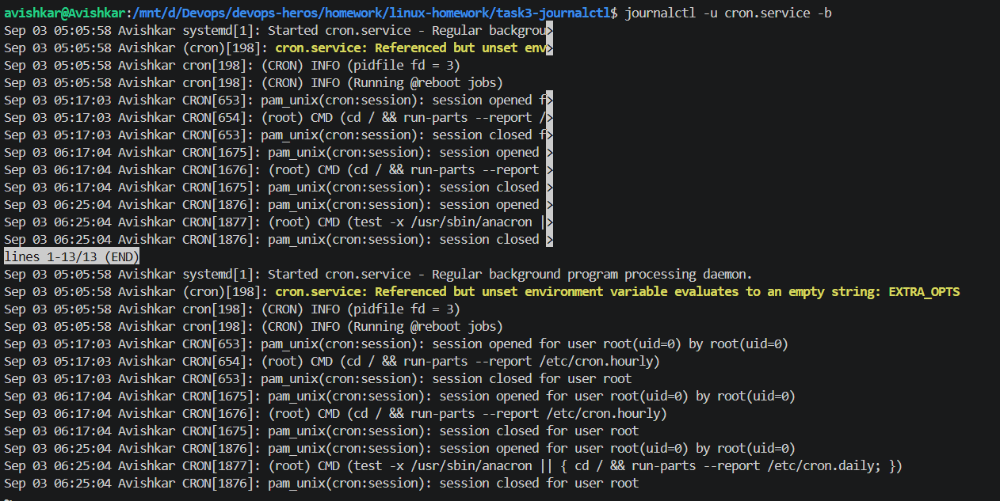

# Task 3: journalctl

I used journalctl to understand how Linux system logs can be viewed and checked. I first viewed the latest system logs and then checked the logs for cron.service using journalctl -u cron.service. This showed me the events and messages related specifically to the cron service. I also used systemctl status cron.service to confirm that the service was running. Finally, I checked the logs from the current system boot. Through this task, I understood that journalctl is useful for checking system and service logs, especially when trying to find warnings, errors, or understand what happened with a particular service.

> `journalctl -u cron.service -n 20` showing the last 20 lines of cron's log, including the stop and the new boot marker.  
> This shows how to read the log of one specific service.  

> `systemctl status cron.service` showing cron as `enabled` and `active (running)` with PID 198, memory and the latest log lines.  
> This confirms the service is up (the status block is printed twice because of the pager).  

> `journalctl -u cron.service -b` showing only cron's log lines from the current boot (13 lines), first in the pager and then as full text.  
> This shows how to limit the log to this boot.  
