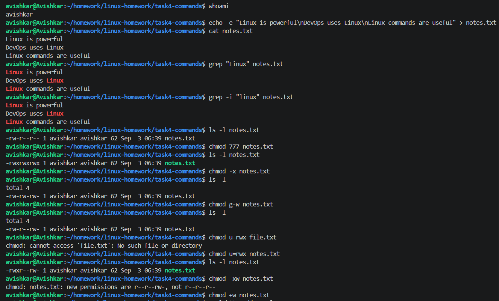

# Task 4: Commands

I used whoami to check the currently logged-in user. I used grep to search for specific text inside a file. I also used chmod to change the permissions of a shell script and make it executable. Using curl, I made an HTTP request and checked the response from a website. Finally, I used top and htop to monitor the running processes and view CPU and memory usage. This task helped me understand how these commands are used for searching, managing permissions, checking users, making network requests, and monitoring system processes.

> `whoami`, then `notes.txt` made with `echo -e`, searched with `grep` and `grep -i`, and its permissions changed with `chmod 777`, `-x`, `g-w` and `u=rwx`, checking with `ls -l` each time.  
> Two commands errored: `chmod u=rwx file.txt` (no such file) and `chmod -xw` (invalid new permissions message). This shows how symbolic and numeric chmod change the permission bits.  

> `curl https://example.com` printing the page HTML, `curl -I` printing only the headers (`HTTP/2 200`, `content-type`, `server: cloudflare`), and the first lines of `top`.  
> This shows how to check a website from the terminal.  

> `htop` with 16 CPU bars at about 0%, memory 451M/7.60G, 33 tasks, and the process list with the F1-F10 menu at the bottom.  
> This shows an interactive view of CPU, memory and processes.  
