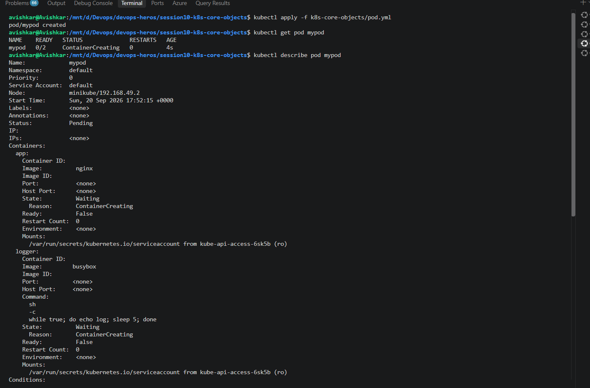
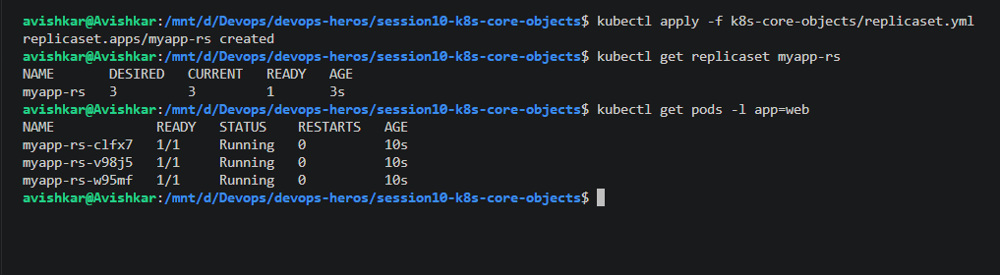
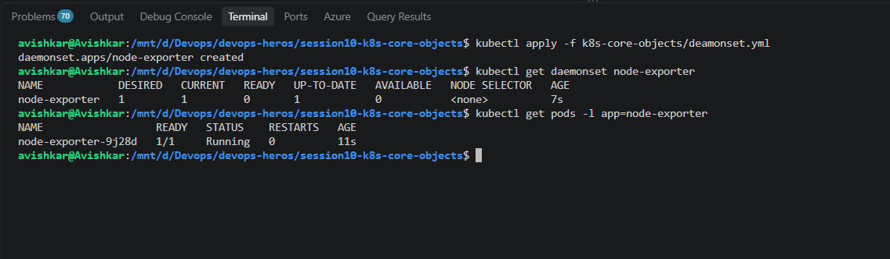

# POD

> `kubectl apply -f pod.yml` creates `mypod`; `get pod` shows `0/2 ... ContainerCreating` and `describe pod` lists node `minikube`, status Pending and two containers: `app` (nginx) and `logger` (busybox running `while true; do echo log; sleep 5; done`).  
> This shows a multi-container pod being created.  
> **Observation:** READY is 0/2 because a pod counts every container, and both were still waiting on `ContainerCreating` (images being pulled) after 4 seconds. The two containers share one pod so they are scheduled to the same node together.

# Deployment

> `kubectl apply -f deployment.yml`, then `get deployment myapp` going from `1/3` to `3/3`, `get pods -l app=myapp` listing three Running pods and `rollout status` saying "successfully rolled out".  
> This shows a deployment creating three replicas.  
> **Observation:** The deployment makes a ReplicaSet that creates the pods, which is why the pod names are `myapp-<hash>-<id>`. They did not start at the same time, so READY climbed from 1/3 to 3/3 within seconds.

# ReplicaSet

> `kubectl apply -f replicaset.yml` creates `myapp-rs`; `get replicaset` shows DESIRED 3, CURRENT 3, READY 1, and `get pods -l app=web` shows three Running pods named `myapp-rs-xxxxx`.  
> This shows a ReplicaSet keeping 3 pods.  
> **Observation:** CURRENT 3 means the ReplicaSet created all pods straight away, and READY 1 means only one had passed its start-up at that moment. The pod names have no hash in the middle because there is no Deployment above this ReplicaSet.

# Demonset

> `kubectl apply -f deamonset.yml` creates `node-exporter`; `get daemonset` shows DESIRED 1, CURRENT 1, READY 0, and one pod `node-exporter-9j28d` Running.  
> This shows a DaemonSet starting a pod.  
> **Observation:** DESIRED is 1 because a DaemonSet runs one pod per node and minikube has a single node. READY was still 0 only because the pod had started 7 seconds before.

# Statefulset

> Creating the `mysql` service with `clusterip=None`, applying `statefulset.yml` (twice, the second time says "configured"), then `get statefulset` stuck at `0/3`, a single `mysql-0 ContainerCreating`, and finally `mysql-0`, `mysql-1`, `mysql-2` all Running and `3/3`.  
> This shows a StatefulSet creating ordered pods.  
> **Observation:** A StatefulSet starts pods one at a time: `mysql-1` and `mysql-2` are only 6s and 5s old while `mysql-0` is 43s old, so they were created after `mysql-0` was ready. The names are fixed (`-0`, `-1`, `-2`) and the headless service gives each a stable DNS name.
