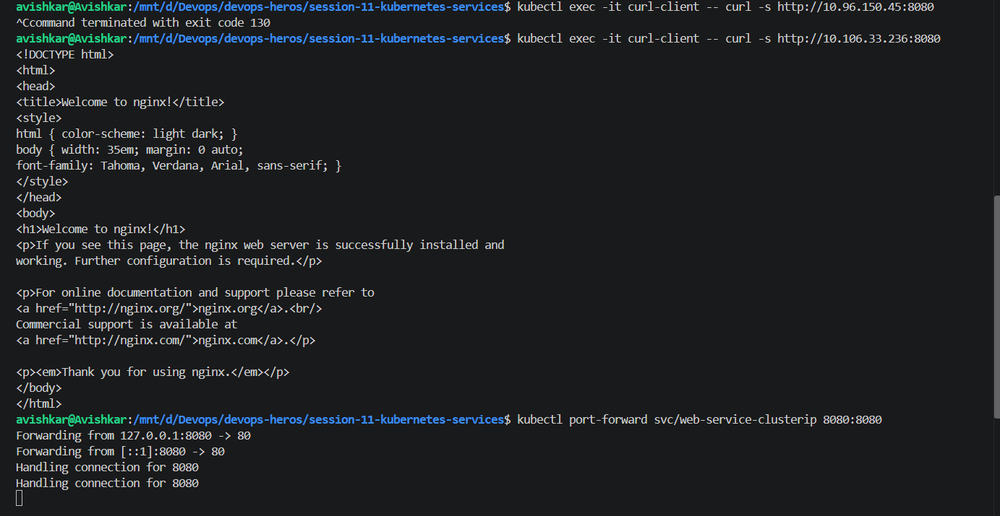
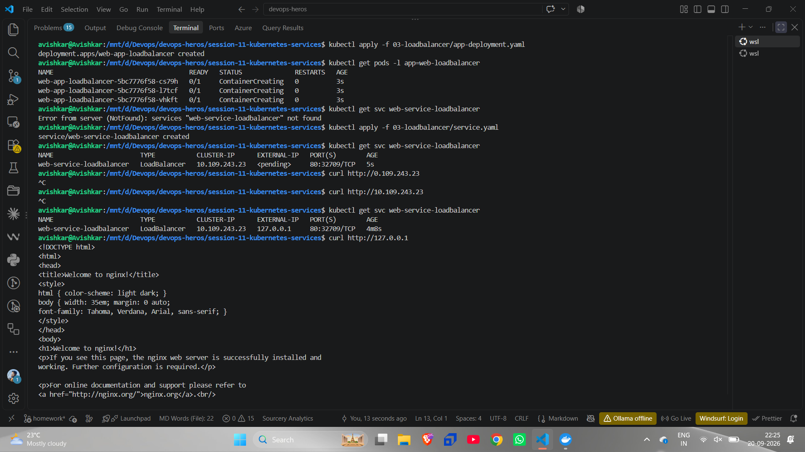
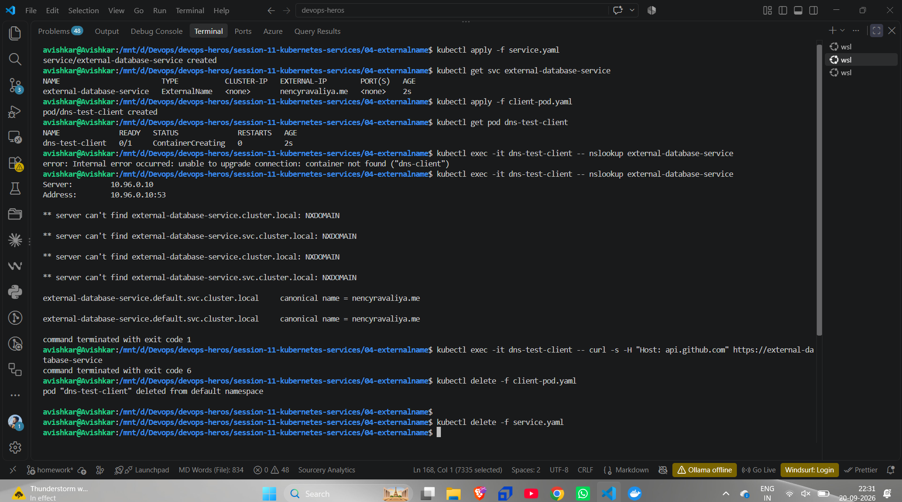
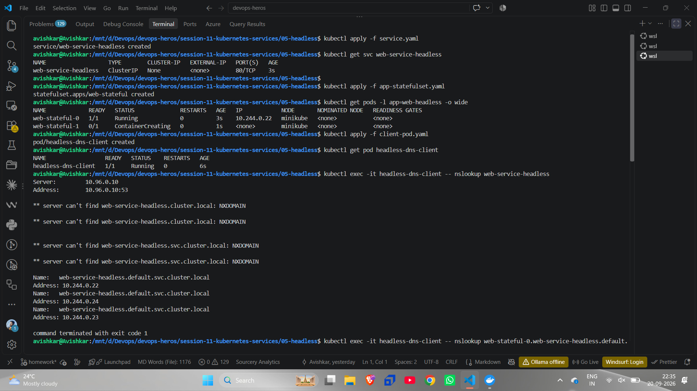

# ClusterIP

> Applying the ClusterIP deployment (3 pods with IPs 10.244.0.179 to .181) and `service.yaml`; `get svc` shows ClusterIP 10.106.33.236 and `get endpoints` lists the three pod IPs on port 80. A `curl-client` pod runs `curl` on the service and gets the nginx welcome page.  
> This shows a ClusterIP service reaching pods from inside the cluster.  
> **Observation:** The Endpoints list is how the service knows which pods to send traffic to (pods matching its selector). The curl works because it runs inside the cluster, and a ClusterIP has no meaning outside it.

> `curl` on 10.96.150.45:8080 is stopped with Ctrl+C (exit code 130), then `curl` on 10.106.33.236:8080 returns the nginx page, and `kubectl port-forward svc/web-service-clusterip 8080:8080` prints "Forwarding from 127.0.0.1:8080 -> 80".  
> This shows a failed and a working request, and port-forward.  
> **Observation:** The first IP does not belong to this service (it is not the one from `get svc`), so the request just hung until I cancelled it. `port-forward` is needed to reach a ClusterIP from my own machine, and it maps 8080 on the service to port 80 of the pod.

> Browser at `localhost:8080` showing the "Welcome to nginx!" page.  
> This shows the service answering through the port-forward.  
> **Observation:** This is the same service, reached from outside the cluster only because of the tunnel started by `port-forward`.

# NodePORT

> NodePort deployment (2 pods) and service `web-service-nodeport` (`80:30080/TCP`). `curl localhost:30080` fails ("Couldn't connect to server"), `curl $(minikube ip):30080` is cancelled, and `minikube service web-service-nodeport` prints a table and starts a tunnel at 127.0.0.1:40759.  
> This shows a NodePort service and how I reached it in minikube.  
> **Observation:** A NodePort opens port 30080 on the node (192.168.49.2), not on my laptop. Minikube runs in Docker, so that IP is not reachable from the host, and the message "Because you are using a Docker driver ... the terminal needs to be open" explains why `minikube service` has to make a tunnel.

# Loadbalancer

> The LoadBalancer deployment (3 pods, `ContainerCreating`), a first `get svc` error ("services ... not found"), then the service applied with `EXTERNAL-IP <pending>`. Two `curl`s are cancelled (one has a typo, `0.109...`), and a later `get svc` shows `EXTERNAL-IP 127.0.0.1`; `curl http://127.0.0.1` returns the nginx page.  
> This shows a LoadBalancer service getting an external IP.  
> **Observation:** The first error is just ordering: I applied the deployment but not yet the service. `<pending>` means nobody had given the service an external IP yet, because minikube has no cloud load balancer by itself (the tunnel that sets it is not visible in this screenshot). After it became 127.0.0.1 the request worked.

> The end of the nginx HTML, then `kubectl delete -f 03-loadbalancer/service.yaml` and `app-deployment.yaml` confirming both are deleted.  
> This shows the cleanup of the LoadBalancer demo.  
> **Observation:** Deleting the service and deployment with the same files that created them removes everything for this demo.

# Extername

> ExternalName service `external-database-service` (`EXTERNAL-IP` shows an external domain, no cluster IP), a `dns-test-client` pod, and `nslookup`. The first `exec` fails with "container not found", the second prints several `NXDOMAIN` lines and then `external-database-service.default.svc.cluster.local canonical name = ...`. A `curl` at the end exits with code 6.  
> This shows an ExternalName service resolving as a DNS alias.  
> **Observation:** The service has no pod or IP; the cluster DNS just answers with a CNAME to the external name. The `NXDOMAIN` lines come from the DNS search list trying `.cluster.local` and `.svc.cluster.local` variants first, until `default.svc.cluster.local` matches. The first exec failed only because the pod was still `ContainerCreating`, and curl's code 6 means it could not resolve the host.

# Headless

> Headless service `web-service-headless` (`CLUSTER-IP None`), a StatefulSet with `web-stateful-0` Running and `web-stateful-1` still creating, a `headless-dns-client` pod, and `nslookup web-service-headless` returning three addresses (10.244.0.22, .24, .23) after some `NXDOMAIN` lines.  
> This shows a headless service returning pod IPs.  
> **Observation:** With no cluster IP there is nothing to load-balance, so DNS returns one record per pod and the client picks. The pods start in order, which is why `-1` is still `ContainerCreating` while `-0` is already Running.

> `nslookup web-stateful-0.web-service-headless.default.svc.cluster.local` returning only 10.244.0.22, a `curl` on that pod name returning the nginx page, and then `kubectl delete` of the client pod, the StatefulSet and the service.  
> This shows reaching one specific pod by its stable DNS name.  
> **Observation:** A StatefulSet plus a headless service gives each pod its own DNS name, so I can talk to exactly `web-stateful-0` instead of any pod. The deletes at the bottom clean up the demo.
