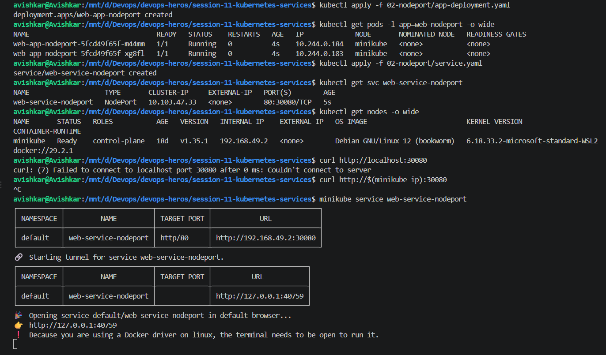

> NodePort deployment (2 pods) and service `web-service-nodeport` (`80:30080/TCP`). `curl localhost:30080` fails ("Couldn't connect to server"), `curl $(minikube ip):30080` is cancelled, and `minikube service web-service-nodeport` prints a table and starts a tunnel at 127.0.0.1:40759.  
> This shows a NodePort service and how I reached it in minikube.  
> **Observation:** A NodePort opens port 30080 on the node (192.168.49.2), not on my laptop. Minikube runs in Docker, so that IP is not reachable from the host, and the message "Because you are using a Docker driver ... the terminal needs to be open" explains why `minikube service` has to make a tunnel.
