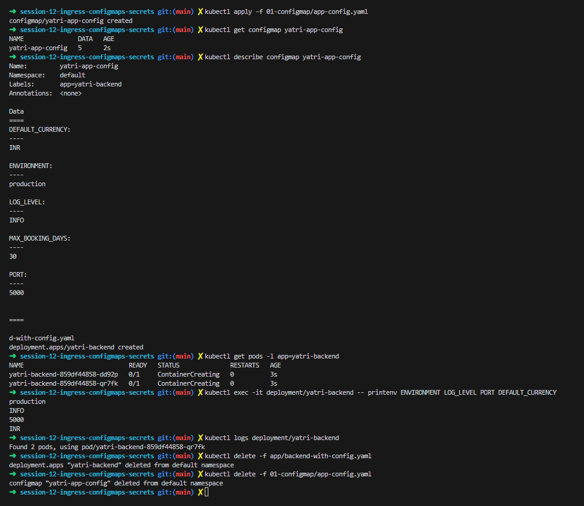

> `kubectl apply -f 01-configmap/app-config.yaml`, `get configmap yatri-app-config` (5 keys) and `describe` listing `DEFAULT_CURRENCY=INR`, `ENVIRONMENT=production`, `LOG_LEVEL=INFO`, `MAX_BOOKING_DAYS=30`, `PORT=5000`. Then a deployment is applied, `printenv` inside it prints the same values, and the deployment and ConfigMap are deleted.  
> This shows a ConfigMap feeding environment variables into pods.  
