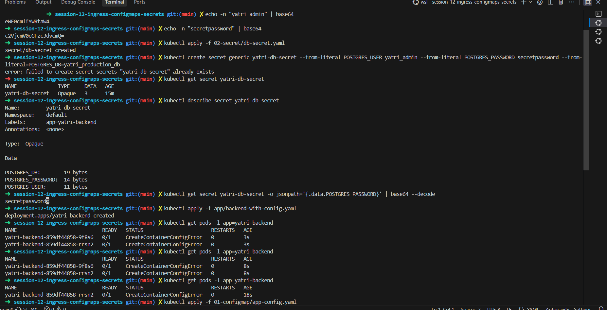
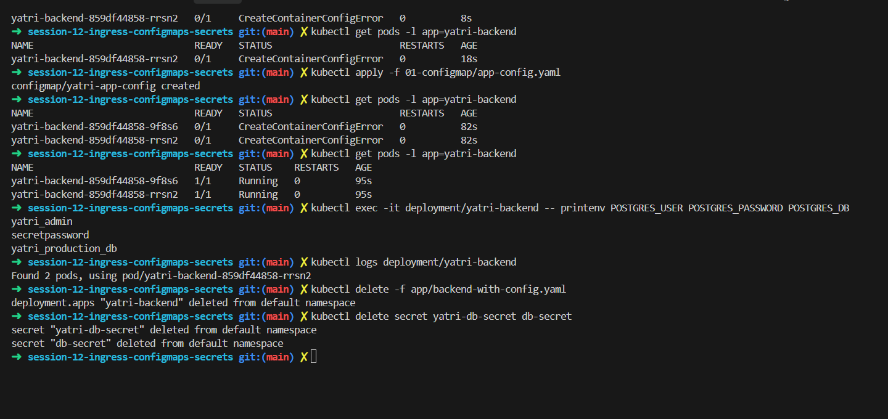

> Secret values encoded with `echo -n ... | base64`, `kubectl apply -f 02-secret/db-secret.yaml`, a `kubectl create secret` that fails with "already exists", `get`/`describe secret` (only byte sizes) and a base64-decoded password. Then the backend deployment is applied and `get pods` shows `CreateContainerConfigError` at 3s, 8s and 18s.  
> This shows the secret working and the pods failing to start.  

> `get pods` still in `CreateContainerConfigError`, then `kubectl apply -f 01-configmap/app-config.yaml` ("configmap/yatri-app-config created"). Later `get pods` shows two pods `1/1 Running`, and `printenv` prints the user, password and database name. The deployment and the secrets are then deleted.  
> This shows the fix for the failing pods.  
