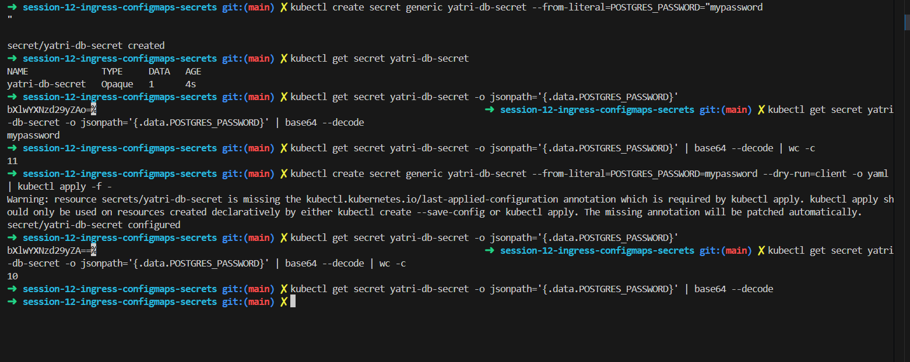

# Troubleshooting log

Each entry is written as issue > investigation > root cause > fix, with the output before and after.

## 1. Pods stuck in `CreateContainerConfigError`

**Issue:** after applying `app/backend-with-config.yaml`, the `yatri-backend` pods never became ready.

**Before:**
```
NAME                             READY   STATUS                       RESTARTS   AGE
yatri-backend-859df44858-9f8s6   0/1     CreateContainerConfigError   0          3s
yatri-backend-859df44858-rrsn2   0/1     CreateContainerConfigError   0          8s
```

**Investigation:** I ran `kubectl get pods -l app=yatri-backend` a few times and the status did not change (18s, 82s). The Secret `yatri-db-secret` already existed (`kubectl get secret` showed 3 items), so the Secret was not the missing piece. The deployment needs a ConfigMap as well.

**Root cause:** the ConfigMap `yatri-app-config` did not exist in the cluster (I had deleted it earlier), so the container could not be created. The only thing I changed before the pods recovered was applying that ConfigMap.

**Fix:** `kubectl apply -f 01-configmap/app-config.yaml` (output: `configmap/yatri-app-config created`).

**After:**
```
NAME                             READY   STATUS    RESTARTS   AGE
yatri-backend-859df44858-9f8s6   1/1     Running   0          95s
yatri-backend-859df44858-rrsn2   1/1     Running   0          95s
```
`kubectl exec -it deployment/yatri-backend -- printenv POSTGRES_USER POSTGRES_PASSWORD POSTGRES_DB` then printed the three values.


> Before: the secret applied and the pods in `CreateContainerConfigError`.


> After: the ConfigMap applied, the pods `1/1 Running` and the `printenv` output.

## 2. Secret value had an extra newline

**Issue:** I created the secret with `kubectl create secret generic yatri-db-secret --from-literal=POSTGRES_PASSWORD="mypassword` and the closing quote ended up on the next line.

**Before:**
```
$ kubectl get secret yatri-db-secret -o jsonpath='{.data.POSTGRES_PASSWORD}' | base64 --decode | wc -c
11
```
"mypassword" is 10 characters, so there was one extra character.

**Investigation:** I decoded the stored value and counted its characters with `wc -c`. The base64 string also differed (`...ZAo=` before and `...ZA==` after).

**Root cause:** the line break inside the quotes was saved as part of the password (a trailing newline).

**Fix:** regenerated the secret and applied it over the old one: `kubectl create secret generic yatri-db-secret --from-literal=POSTGRES_PASSWORD=mypassword --dry-run=client -o yaml | kubectl apply -f -` (output: `secret/yatri-db-secret configured`). kubectl also warned about a missing `last-applied-configuration` annotation because the secret was first made with `create`, and it patched it automatically.

**After:**
```
$ kubectl get secret yatri-db-secret -o jsonpath='{.data.POSTGRES_PASSWORD}' | base64 --decode | wc -c
10
```



> The 11 vs 10 character count before and after recreating the secret.

## 3. `kubectl apply` could not find the file

**Issue:** `kubectl apply -f secret/db-secret.yaml` failed.

**Before:** `error: the path "secret/db-secret.yaml" does not exist`

**Investigation:** the prompt showed I was already inside the `02-secret` folder.

**Root cause:** wrong relative path, because the path started from the project root but I was in the sub-folder.

**Fix:** `kubectl apply -f db-secret.yaml`

**After:** `secret/yatri-db-secret created`, and `kubectl get secret` shows 3 items.


> The failed apply, then the working one, in the `02-secret` folder.

## 4. `kubectl create secret` said the secret already exists

**Issue:** `kubectl create secret generic yatri-db-secret ...` failed.

**Before:** `error: failed to create secret secrets "yatri-db-secret" already exists`

**Investigation:** `kubectl get secret yatri-db-secret` showed the secret (`Opaque`, 3 items, 15m old) and `describe` showed its keys.

**Root cause:** I had already created the same secret by applying `02-secret/db-secret.yaml`.

**Fix:** no new secret was needed. I used the existing one (checked it with `describe` and a base64 decode).

**After:** the pods used it through `printenv` (see entry 1).

## 5. Ingress shows backend services as "not found"

**Issue:** `kubectl describe ingress yatri-ingress` listed the backends with an error.

**Before:**
```
/api(/|$)(.*)   yatri-backend-service:80 (<error: services "yatri-backend-service" not found>)
/               yatri-frontend-service:80 (<error: services "yatri-frontend-service" not found>)
```

**Investigation:** the Ingress itself was fine (address 192.168.49.2, class nginx, event "Scheduled for sync"). Only the backends were reported missing.

**Root cause:** the Ingress points at two Services that I had not created yet.

**Fix:** not captured in my screenshots. The fix would be to create `yatri-backend-service` and `yatri-frontend-service`; I did not record an "after" output for this one.


> `describe ingress` showing the not-found backends, followed by the TLS ingress I made after that.
