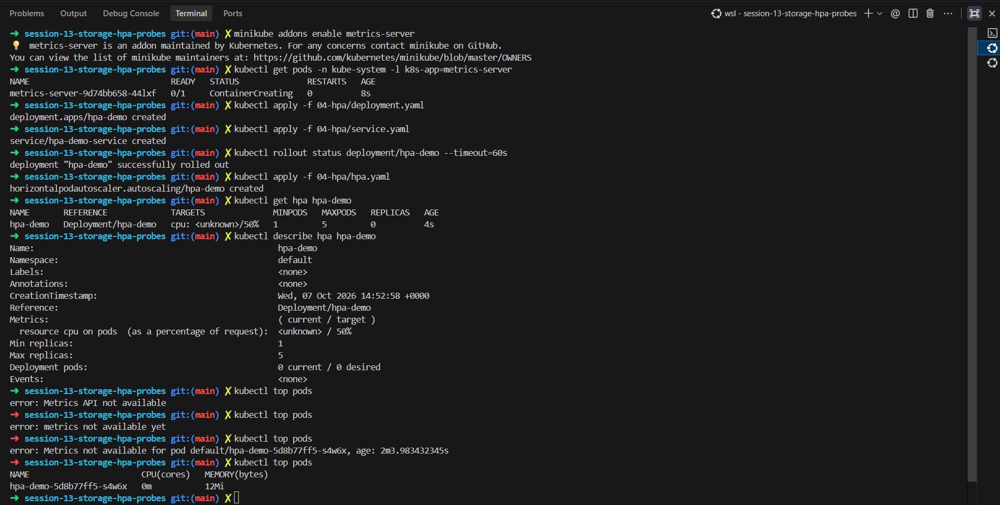
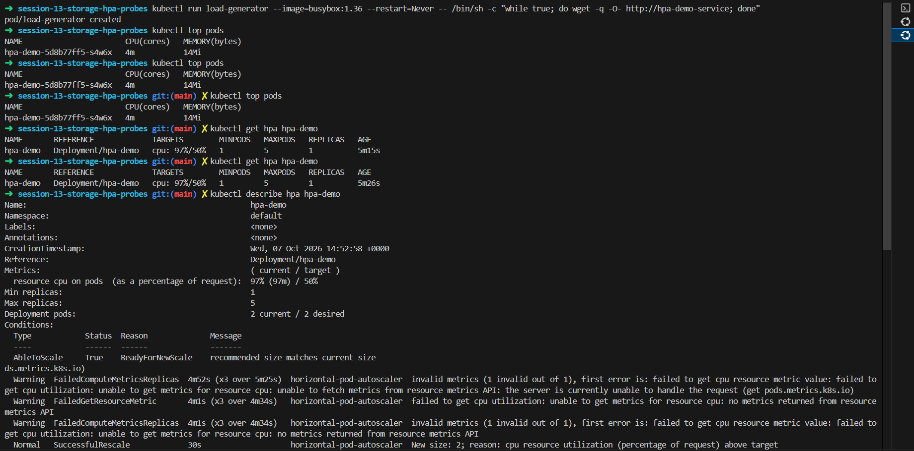
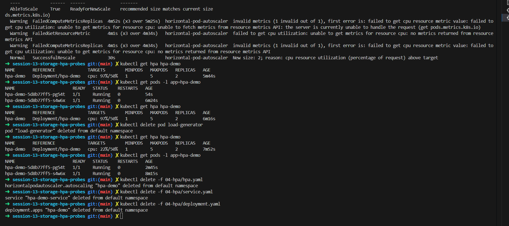

> `minikube addons enable metrics-server`, the metrics-server pod `ContainerCreating`, then the `hpa-demo` deployment, service and `hpa.yaml` applied. `get hpa` shows `cpu: <unknown>/50%`, `describe hpa` shows 0 current / 0 desired pods, and `kubectl top pods` errors ("Metrics API not available") until the last try returns `hpa-demo-... 0m 12Mi`.  
> This shows the HPA being set up and waiting for metrics.  
> **Observation:** The HPA needs the metrics-server to read CPU. Until its pod was ready the target is `<unknown>` and `top pods` fails, so there was nothing to compare with the 50% target. Later the metrics API came up and `top` showed almost no CPU use.

> `kubectl run load-generator` (busybox looping `wget` on the service), several `kubectl top pods` (CPU 4m), then `get hpa` showing `cpu: 97%/50%` with 1 replica and `describe hpa` listing the earlier `FailedGetResourceMetric` warnings and `SuccessfulRescale ... New size: 2; reason: cpu resource utilization ... above target`.  
> This shows the load pushing CPU above the target and the HPA reacting.  
> **Observation:** 97% of the CPU request is well over the 50% target, so the HPA raised replicas from 1 to 2. The warnings in Events are from the minutes before metrics were available and are not a failure of the scaling.

> `get hpa` (97%/50%, 2 replicas), `get pods -l app=hpa-demo` (two Running), `kubectl delete pod load-generator`, `get hpa` showing 22%/50%, and then the HPA, service and deployment being deleted.  
> This shows the effect of stopping the load, and the cleanup.  
> **Observation:** Once the load generator was removed, CPU fell to 22%, below the target. The HPA still shows 2 replicas at that moment because it waits before scaling down (the default stabilization window is about 5 minutes) so it does not flap up and down.
