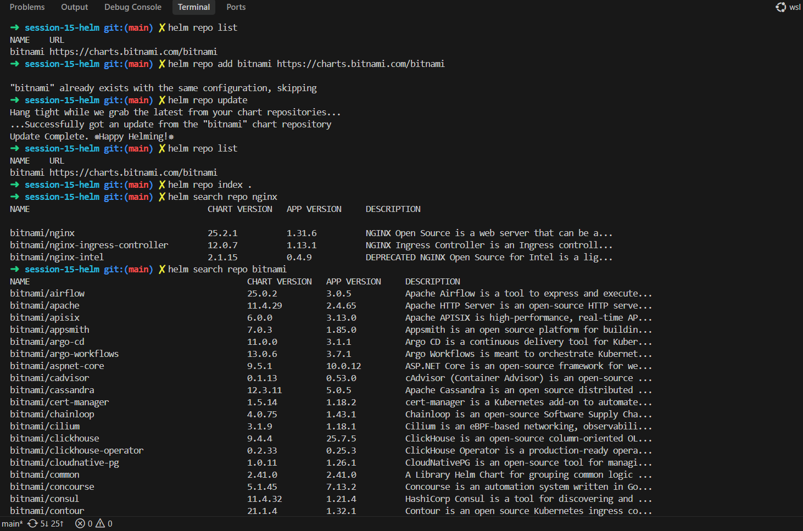
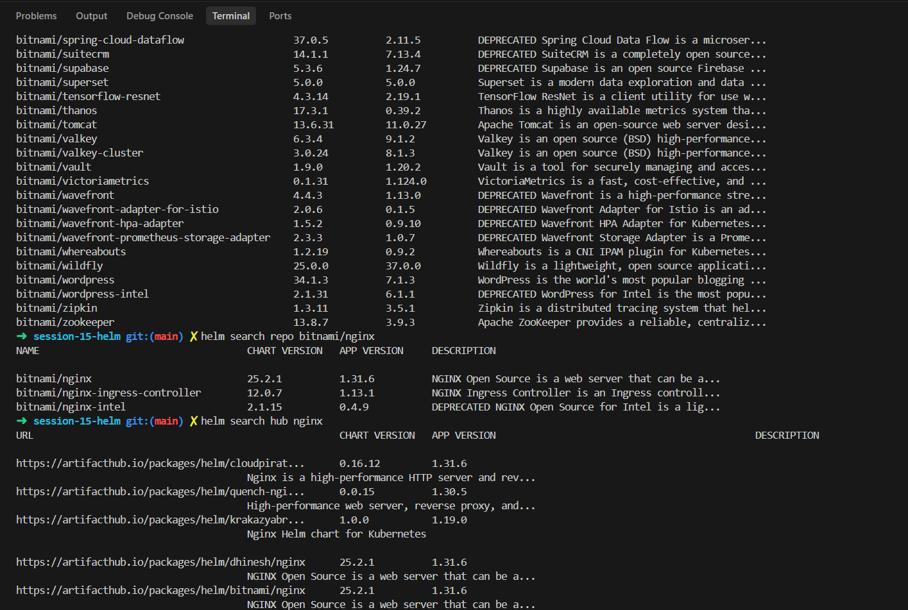
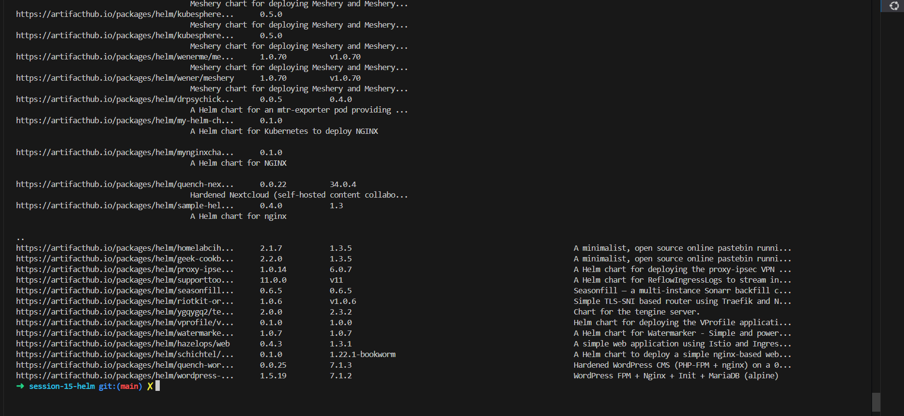

<video controls src="videos/20261008-1020-07.7971619.mp4" title="Title"></video>

# Task 1: Helm Commands

> Terminal with the repo commands below, run in this order.

| Command | Output | What it did |
|---|---|---|
| `helm repo list` | `bitnami  https://charts.bitnami.com/bitnami` | Listed the chart repositories I already had. |
| `helm repo add bitnami https://charts.bitnami.com/bitnami` | `"bitnami" already exists with the same configuration, skipping` | Tried to add the bitnami repo; it was already there. |
| `helm repo update` | `...Successfully got an update from the "bitnami" chart repository. Update Complete. Happy Helming!` | Downloaded the latest chart list from my repos. |
| `helm repo list` | same bitnami line | Checked the repo list again. |
| `helm repo index .` | no output | Ran the index command on the current folder; nothing was printed. |
| `helm search repo nginx` | `bitnami/nginx 25.2.1 (app 1.31.6)`, `bitnami/nginx-ingress-controller 12.0.7`, `bitnami/nginx-intel 2.1.15` | Searched my added repos for charts with "nginx". |
| `helm search repo bitnami` | long table starting `bitnami/airflow`, `bitnami/apache`, `bitnami/apisix` ... | Listed every chart in the bitnami repo. |

> The end of the bitnami list (up to `bitnami/zookeeper`) and the next two searches.

| Command | Output | What it did |
|---|---|---|
| `helm search repo bitnami/nginx` | the same 3 nginx rows as before | Narrowed the search to the `bitnami/nginx` name. |
| `helm search hub nginx` | `https://artifacthub.io/packages/helm/cloudpirat...`, `.../bitnami/nginx` and many more | Searched Artifact Hub, so I got charts from many publishers, not only bitnami. |

> More of the `helm search hub nginx` results: a long list of Artifact Hub URLs, versions and descriptions, ending at the prompt.
