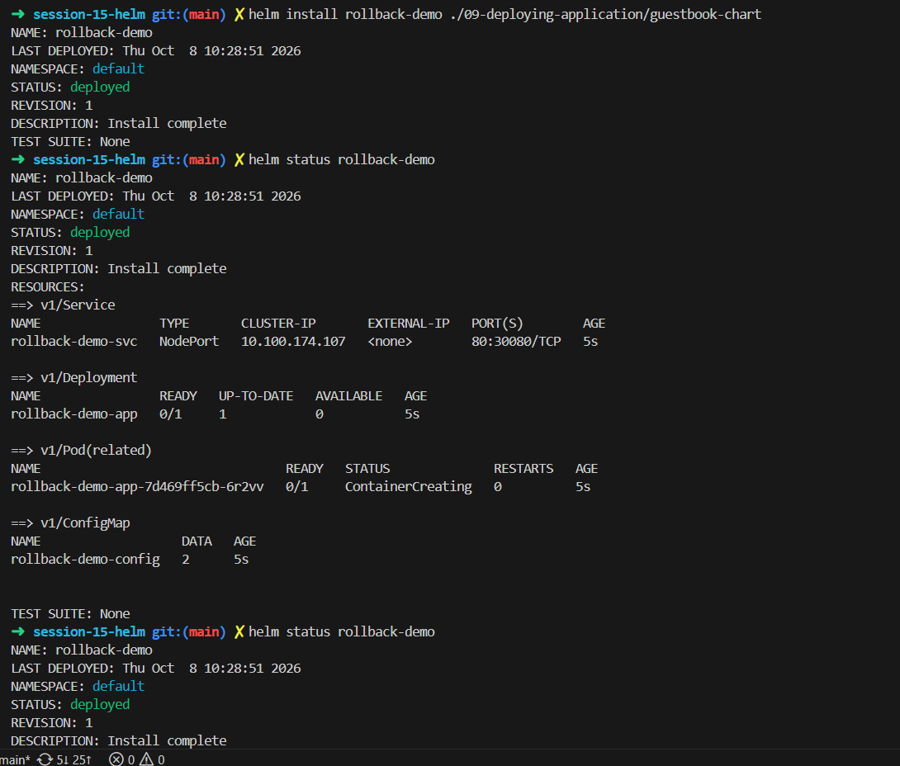
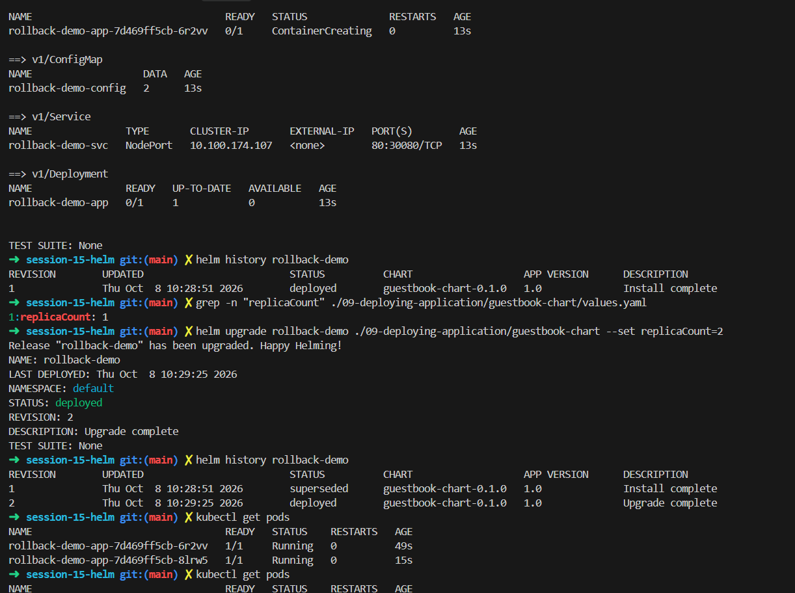
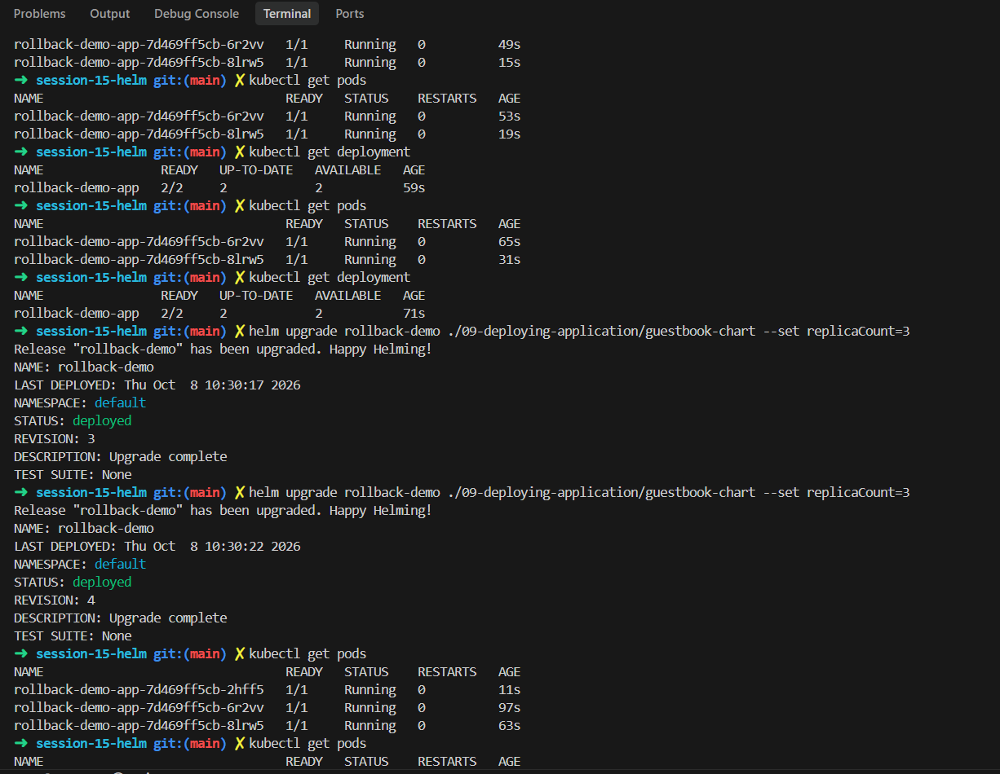
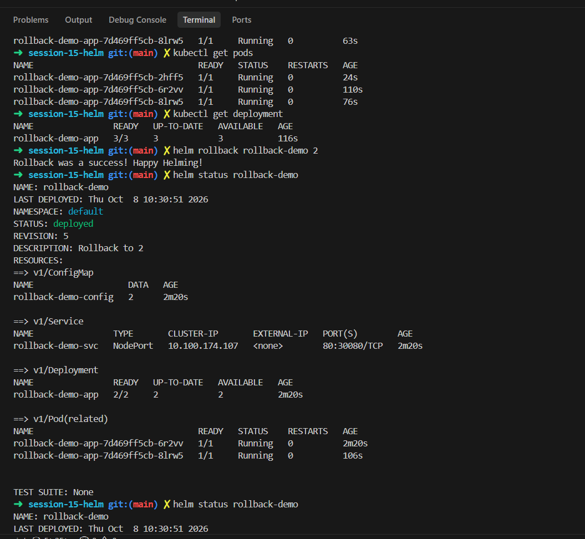
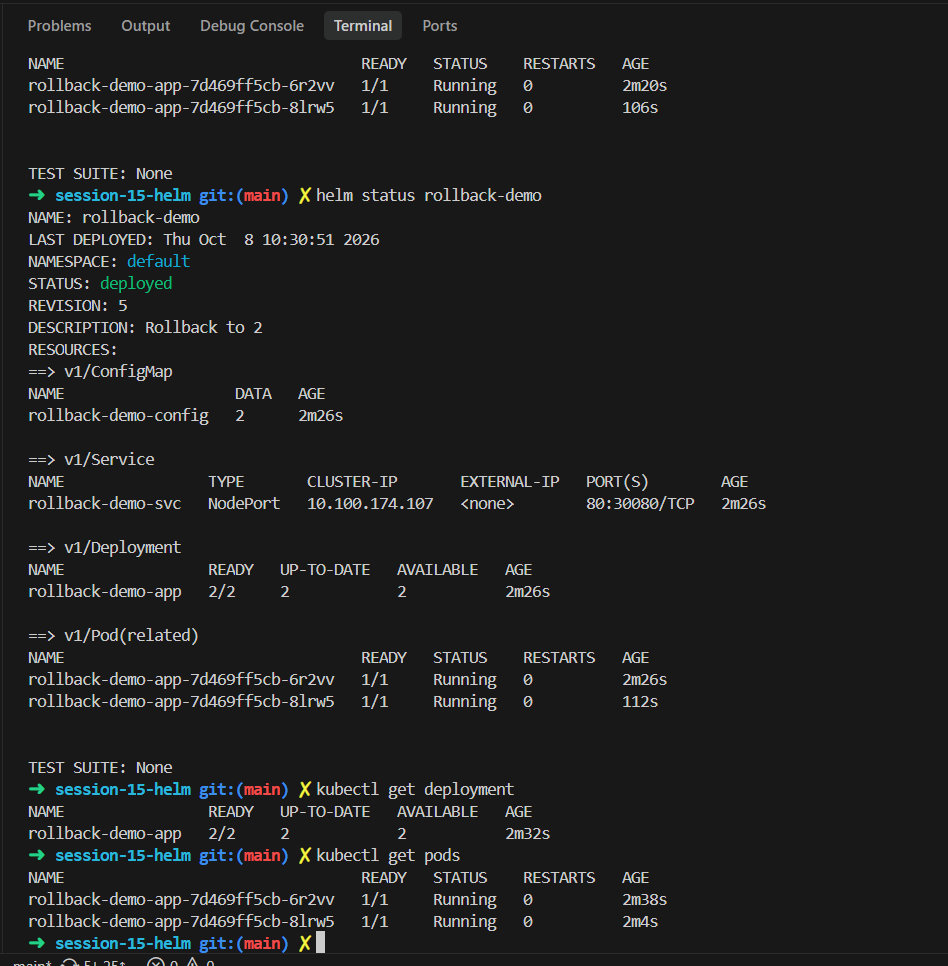

# Task 2: Helm Rollback

Chart used: `./09-deploying-application/guestbook-chart`, release name `rollback-demo`.

> `helm install` and `helm status` right after it.

| Command | Output | What it did |
|---|---|---|
| `helm install rollback-demo ./09-deploying-application/guestbook-chart` | `STATUS: deployed`, `REVISION: 1`, `DESCRIPTION: Install complete` | Installed the chart as release `rollback-demo`. |
| `helm status rollback-demo` | Service `rollback-demo-svc` NodePort `80:30080/TCP`, Deployment `rollback-demo-app 0/1`, Pod `ContainerCreating`, ConfigMap `rollback-demo-config` | Showed what the release made; the pod was still starting. |

> `helm history`, the values file check, the first upgrade and `kubectl get pods`.

| Command | Output | What it did |
|---|---|---|
| `helm history rollback-demo` | revision 1, `deployed`, `guestbook-chart-0.1.0`, `Install complete` | Listed the release revisions (only one so far). |
| `grep -n "replicaCount" .../values.yaml` | `1:replicaCount: 1` | Checked the default replica count in the chart. |
| `helm upgrade rollback-demo ./09-deploying-application/guestbook-chart --set replicaCount=2` | `Release "rollback-demo" has been upgraded. Happy Helming!`, `REVISION: 2` | Changed the replicas to 2 without editing the file. |
| `helm history rollback-demo` | revision 1 `superseded`, revision 2 `deployed` (`Upgrade complete`) | Showed the new revision. |
| `kubectl get pods` | `...6r2vv 1/1 Running 49s`, `...8lrw5 1/1 Running 15s` | Confirmed the second pod was created. |

> More `kubectl get pods`/`get deployment` checks and two upgrades to 3 replicas.

| Command | Output | What it did |
|---|---|---|
| `kubectl get deployment` | `rollback-demo-app 2/2` | Checked the deployment has 2 replicas. |
| `helm upgrade ... --set replicaCount=3` | `REVISION: 3`, `Upgrade complete` | Scaled to 3 replicas. |
| `helm upgrade ... --set replicaCount=3` (again) | `REVISION: 4`, `Upgrade complete` | Same command repeated by mistake; Helm still made a new revision. |
| `kubectl get pods` | 3 pods Running (`2hff5`, `6r2vv`, `8lrw5`) | Confirmed 3 pods. |

> The deployment at 3/3, the rollback, and `helm status`.

| Command | Output | What it did |
|---|---|---|
| `kubectl get deployment` | `rollback-demo-app 3/3` | Checked 3 replicas before the rollback. |
| `helm rollback rollback-demo 2` | `Rollback was a success! Happy Helming!` | Went back to the settings of revision 2 (2 replicas). |
| `helm status rollback-demo` | `REVISION: 5`, `DESCRIPTION: Rollback to 2`, Deployment `2/2` | Showed the rollback became a new revision (5). |

> Final checks after the rollback.

| Command | Output | What it did |
|---|---|---|
| `helm status rollback-demo` | `REVISION: 5`, `Rollback to 2`, 2 pods Running | Re-checked the release. |
| `kubectl get deployment` | `rollback-demo-app 2/2` | Confirmed the replica count went back to 2. |
| `kubectl get pods` | 2 pods Running (`6r2vv`, `8lrw5`) | Confirmed the third pod was removed. |
