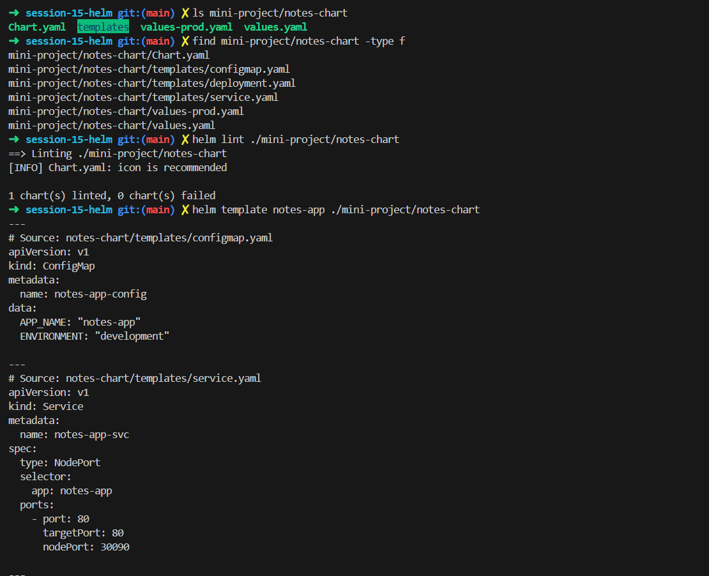
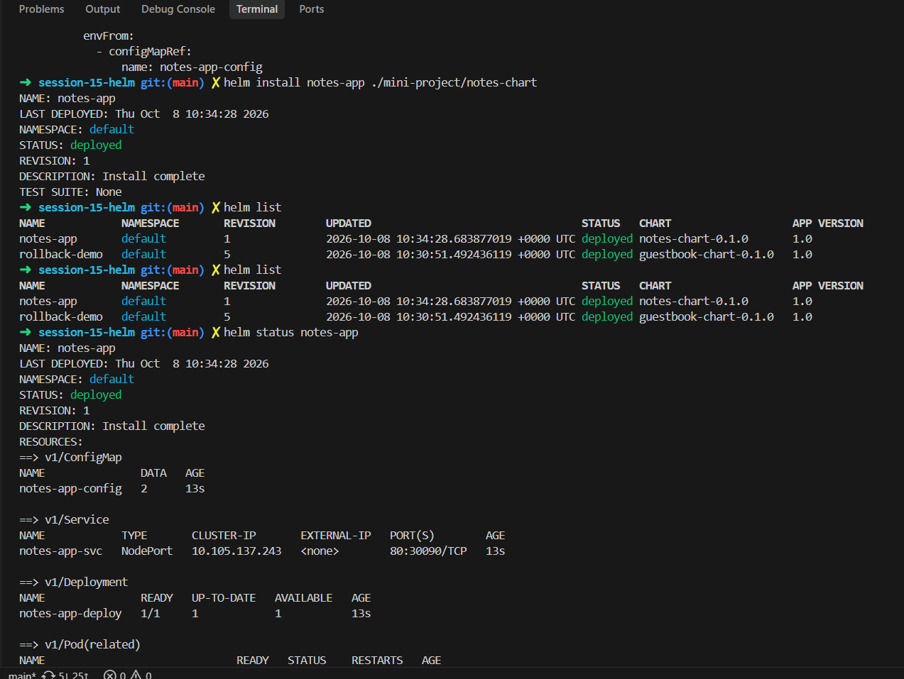
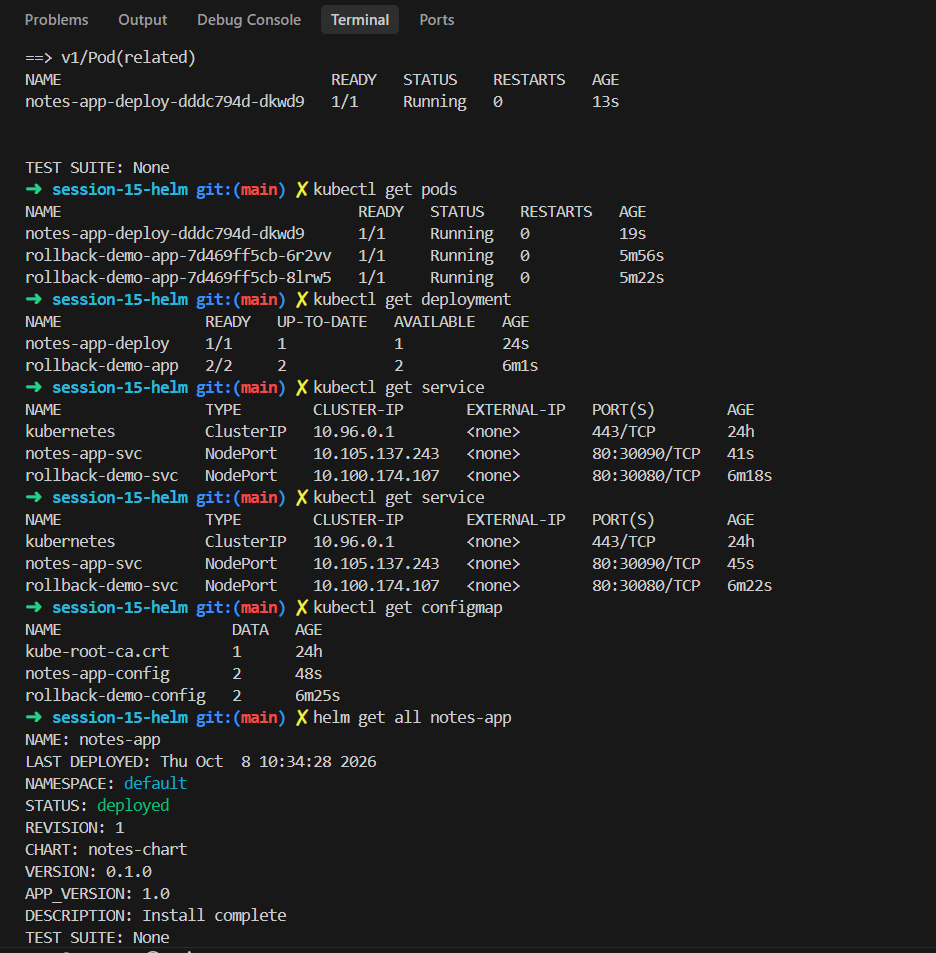
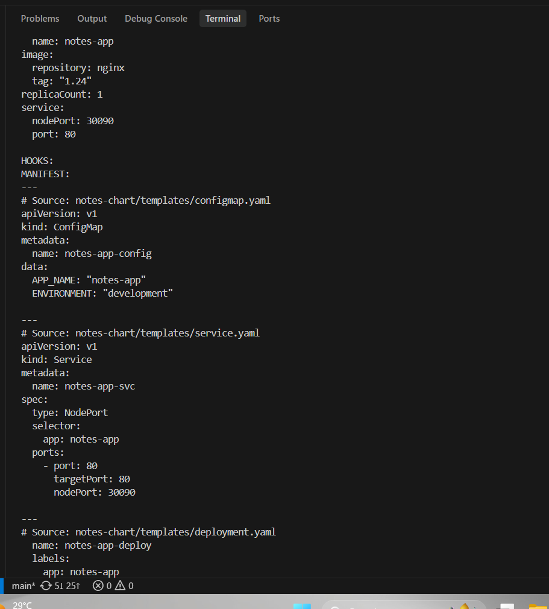
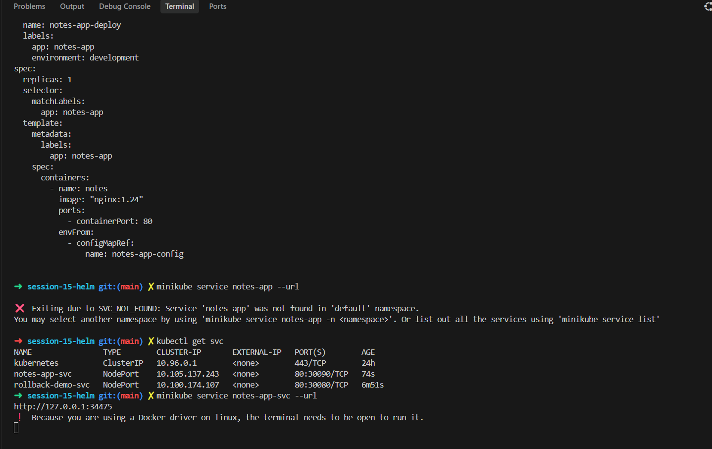
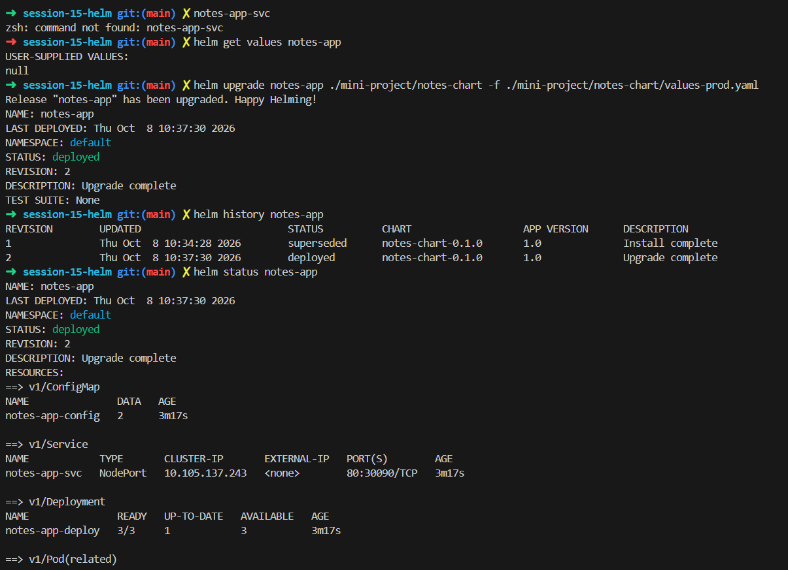
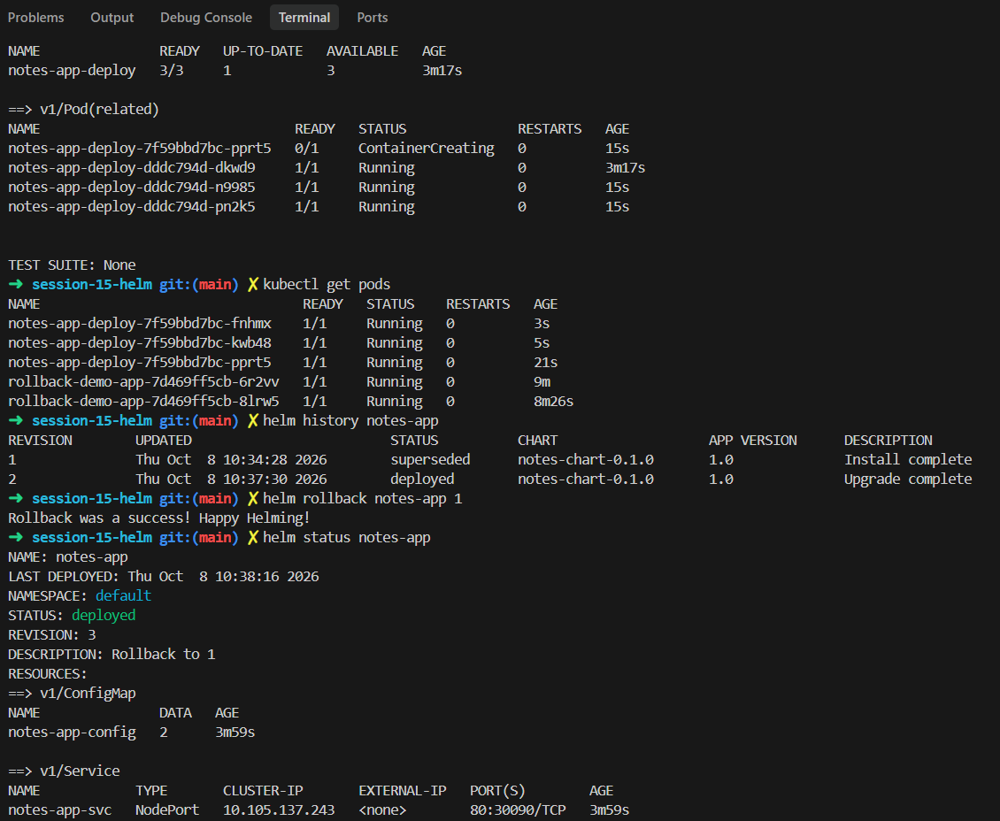
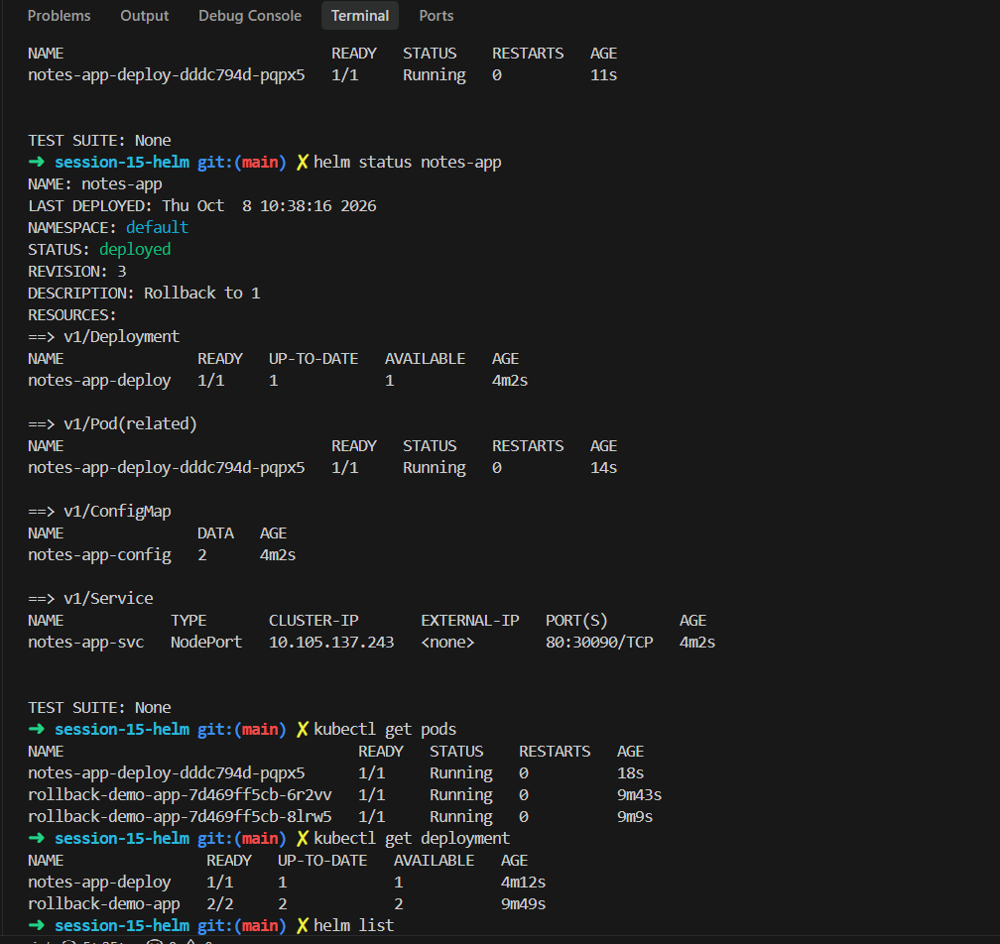
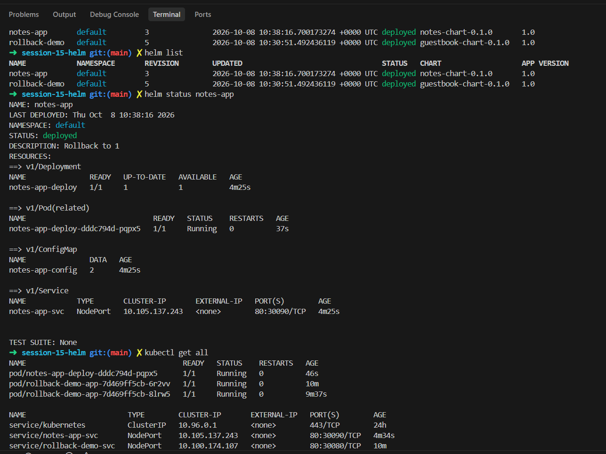
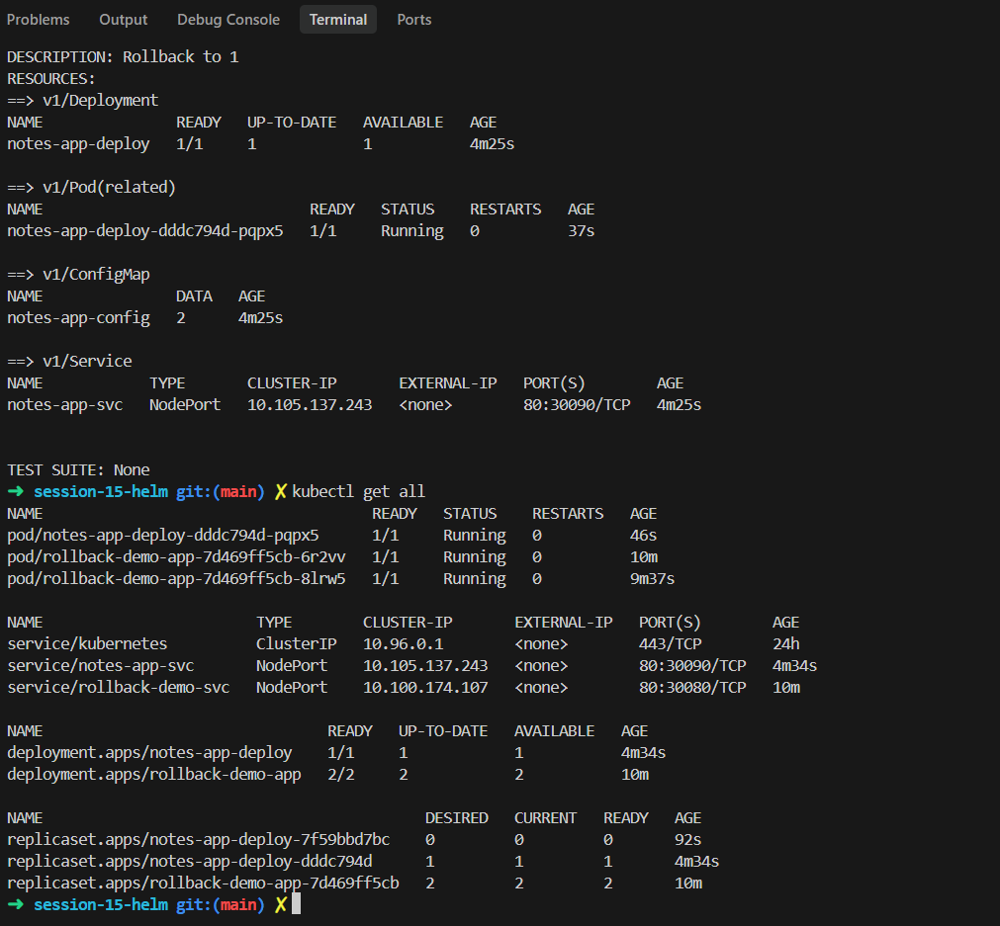

# Task 3: Mini Project (notes-chart)

Chart: `./mini-project/notes-chart`, release name `notes-app`.

> Chart folder, lint and the start of `helm template`.

| Command | Output | What it did |
|---|---|---|
| `ls mini-project/notes-chart` | `Chart.yaml  templates  values-prod.yaml  values.yaml` | Listed the chart folder. |
| `find mini-project/notes-chart -type f` | `Chart.yaml`, `templates/configmap.yaml`, `deployment.yaml`, `service.yaml`, `values-prod.yaml`, `values.yaml` | Listed all files in the chart. |
| `helm lint ./mini-project/notes-chart` | `[INFO] Chart.yaml: icon is recommended`, `1 chart(s) linted, 0 chart(s) failed` | Checked the chart; only an info message. |
| `helm template notes-app ./mini-project/notes-chart` | ConfigMap `notes-app-config` (`APP_NAME`, `ENVIRONMENT: development`) and Service `notes-app-svc` (NodePort 30090) | Rendered the YAML without installing anything. |

> Install, list and status.

| Command | Output | What it did |
|---|---|---|
| `helm install notes-app ./mini-project/notes-chart` | `STATUS: deployed`, `REVISION: 1` | Installed the chart. |
| `helm list` | `notes-app` (revision 1) and `rollback-demo` (revision 5), both `deployed` | Listed releases in the namespace. |
| `helm status notes-app` | ConfigMap, Service NodePort `80:30090/TCP`, Deployment `notes-app-deploy 1/1` | Showed the resources of the release. |

> kubectl checks and the start of `helm get all`.

| Command | Output | What it did |
|---|---|---|
| `kubectl get pods` / `get deployment` / `get service` / `get configmap` | pod `notes-app-deploy-...` Running, service `notes-app-svc` on `30090`, configmap `notes-app-config` | Checked the objects Helm made. |
| `helm get all notes-app` | release info (`CHART: notes-chart`, `VERSION: 0.1.0`, `APP_VERSION: 1.0`) | Printed everything about the release. |

> The values and manifest part of `helm get all`.

| Command | Output | What it did |
|---|---|---|
| `helm get all notes-app` (continued) | computed values (image `nginx` tag `1.24`, `replicaCount: 1`, `nodePort: 30090`) and the ConfigMap/Service manifests | Showed the values used and the manifests applied. |

> The deployment manifest, a wrong service name, and the right one.

| Command | Output | What it did |
|---|---|---|
| `helm get all notes-app` (end) | Deployment `notes-app-deploy` (nginx `1.24`, `envFrom` the ConfigMap) | Finished showing the manifest. |
| `minikube service notes-app --url` | `Exiting due to SVC_NOT_FOUND: Service 'notes-app' was not found` | Failed because the service is called `notes-app-svc`. |
| `kubectl get svc` | `notes-app-svc NodePort 80:30090/TCP` | Checked the real name. |
| `minikube service notes-app-svc --url` | `http://127.0.0.1:34475` | Got a URL for the service (the terminal has to stay open). |

> `helm get values`, the upgrade with the prod values, history and status.

| Command | Output | What it did |
|---|---|---|
| `helm get values notes-app` | `USER-SUPPLIED VALUES: null` | Showed I had not overridden any values. |
| `helm upgrade notes-app ./mini-project/notes-chart -f ./mini-project/notes-chart/values-prod.yaml` | `REVISION: 2`, `Upgrade complete` | Upgraded using the production values file. |
| `helm history notes-app` | revision 1 `superseded`, revision 2 `deployed` | Showed both revisions. |
| `helm status notes-app` | Deployment `notes-app-deploy 3/3` | Showed 3 replicas now (the prod file sets more). |

> New pods starting, then the rollback.

| Command | Output | What it did |
|---|---|---|
| `kubectl get pods` | 3 `notes-app-deploy-7f59bbd7bc-...` pods Running | Confirmed the prod pods. |
| `helm history notes-app` | revision 1 `superseded`, revision 2 `deployed` | Checked history before the rollback. |
| `helm rollback notes-app 1` | `Rollback was a success! Happy Helming!` | Went back to revision 1 settings. |
| `helm status notes-app` | `REVISION: 3`, `Rollback to 1` | Showed the rollback as revision 3. |

> After the rollback: one pod left.

| Command | Output | What it did |
|---|---|---|
| `helm status notes-app` | `REVISION: 3`, Deployment `1/1`, pod `notes-app-deploy-dddc794d-pqpx5` Running | Re-checked the release. |
| `kubectl get pods` / `get deployment` | `notes-app-deploy 1/1` | Confirmed one replica again. |
| `helm list` | `notes-app` revision 3, `rollback-demo` revision 5 | Listed the releases. |

> `helm list`, `helm status` and the start of `kubectl get all`.

| Command | Output | What it did |
|---|---|---|
| `helm list` | `notes-app` revision 3 and `rollback-demo` revision 5, both `deployed` | Checked the final revisions. |
| `helm status notes-app` | `Rollback to 1`, Deployment `1/1` | Final status of the release. |
| `kubectl get all` | pods, services (`notes-app-svc` 30090, `rollback-demo-svc` 30080), deployments | Listed everything in the namespace. |

> The rest of `kubectl get all`, including the ReplicaSets.

| Command | Output | What it did |
|---|---|---|
| `kubectl get all` (continued) | ReplicaSets: `notes-app-deploy-7f59bbd7bc` 0/0/0 (the prod one), `notes-app-deploy-dddc794d` 1/1/1, `rollback-demo-app-7d469ff5cb` 2/2/2 | Showed the old prod ReplicaSet was scaled down to 0 and the original one is back to 1. |
