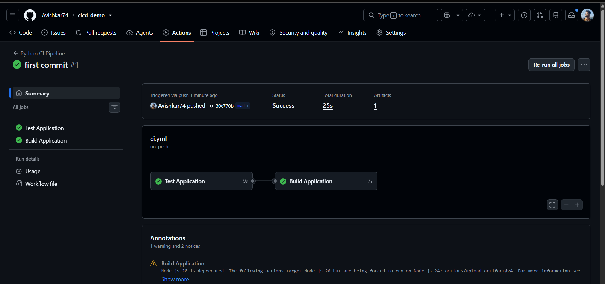

> GitHub Actions run "first commit #1" of the "Python CI Pipeline" (`ci.yml`, triggered by a push to `main`). Jobs `Test Application` (9s) then `Build Application` (7s) both have green ticks, total 25s, with 1 artifact and a Node.js 20 deprecation warning.  
> This shows my first CI pipeline passing.  
