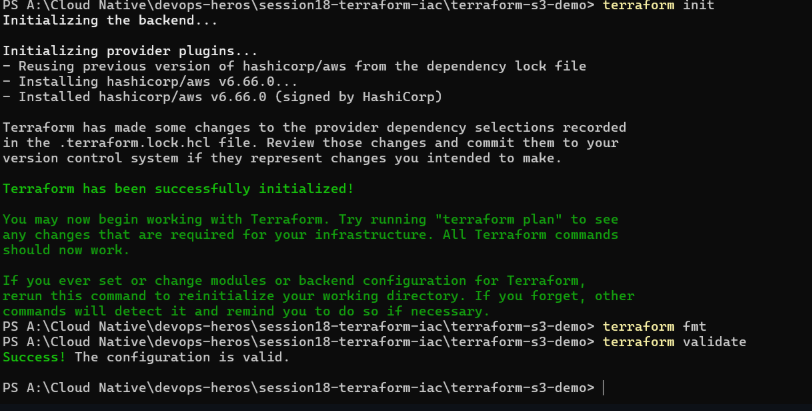
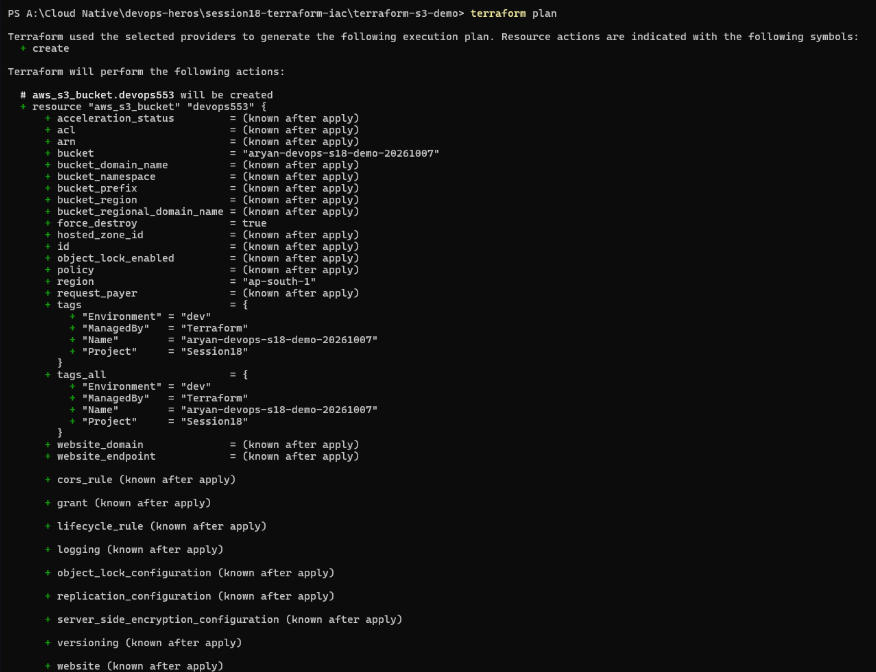
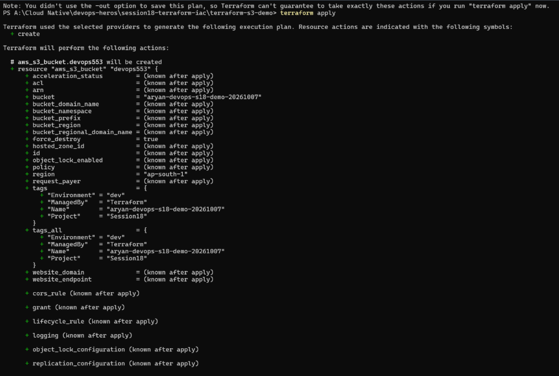
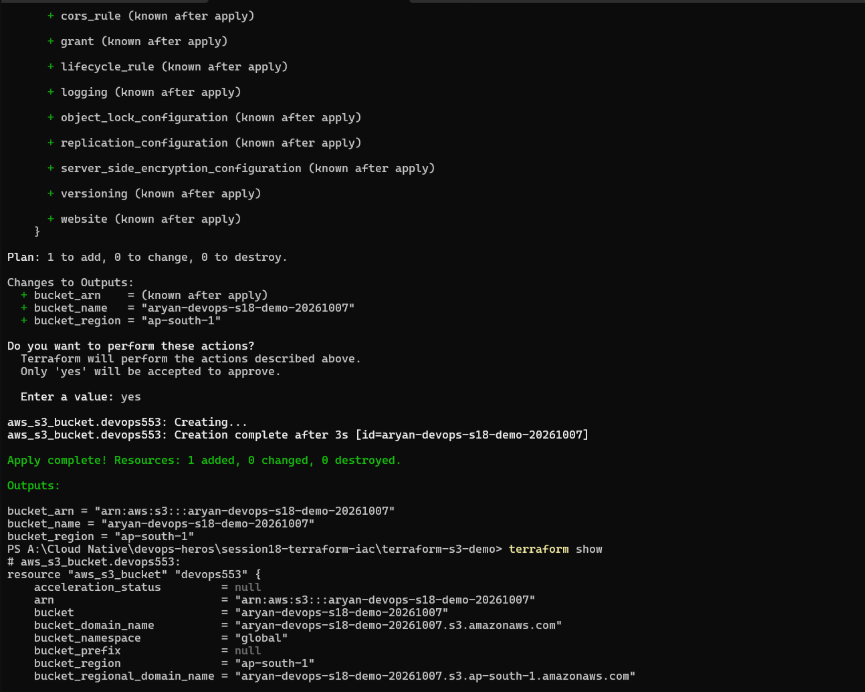
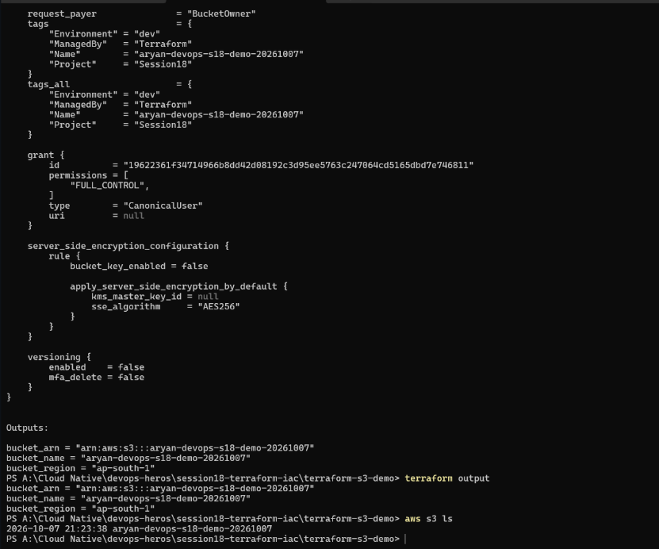
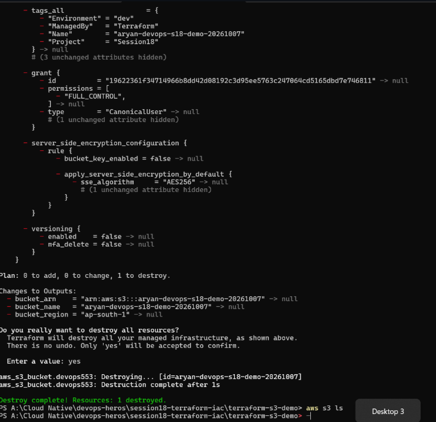

# Terraform workflow: S3 bucket

Project folder: `terraform-s3-demo`. Workflow: init > fmt > validate > plan > apply > show > output > destroy.

## 1. `terraform init`, `terraform fmt`, `terraform validate`

> `terraform init` downloading the AWS provider, then `fmt` and `validate`.

- `terraform init`: reused the dependency lock file, installed `hashicorp/aws v6.66.0` and printed "Terraform has been successfully initialized!". It sets up the provider so the other commands can work.
- `terraform fmt`: printed nothing, which means no file needed reformatting.
- `terraform validate`: "Success! The configuration is valid." It checks the syntax and references without contacting AWS.

## 2. `terraform plan`

> The plan output: one `aws_s3_bucket.devops553` to create.

- `terraform plan` showed `+ create` for `aws_s3_bucket.devops553` with bucket name `aryan-devops-s18-demo-20261007`, region `ap-south-1`, `force_destroy = true` and the tags `Environment=dev`, `ManagedBy=Terraform`, `Project=Session18`. Most other attributes are "(known after apply)".
- It is a dry run: it compares my code with the real state and shows what would change, without changing anything.

## 3. `terraform apply`

> `terraform apply` showing the same plan again, with the note that no `-out` file was saved.

> The end of the plan, the `yes` confirmation and the apply result.

- Apply printed the plan again and a note that I didn't use `-out`, so Terraform can't guarantee the plan is the same.
- The summary was "Plan: 1 to add, 0 to change, 0 to destroy" and the outputs `bucket_arn`, `bucket_name` and `bucket_region`.
- After I typed `yes`: `aws_s3_bucket.devops553: Creation complete after 3s` and "Apply complete! Resources: 1 added, 0 changed, 0 destroyed."

## 4. `terraform show`, `terraform output` and checking in AWS

> The end of `terraform show`, then `terraform output` and `aws s3 ls`. (`terraform show` starts at the bottom of the previous screenshot.)

- `terraform show`: printed the saved state of the bucket: ARN, domain name, region, tags, the `FULL_CONTROL` grant, AES256 server-side encryption and versioning `enabled = false`.
- `terraform output`: printed `bucket_arn`, `bucket_name` and `bucket_region`.
- `aws s3 ls`: listed `aryan-devops-s18-demo-20261007` (created 2026-10-07), which confirms the bucket really exists in AWS.

## 5. `terraform destroy`

> The destroy plan, the `yes` confirmation and the empty `aws s3 ls` afterwards.

- `terraform destroy` showed every attribute going to `null` ("Plan: 0 to add, 0 to change, 1 to destroy") and the outputs being removed.
- After `yes`: "Destruction complete after 1s" and "Destroy complete! Resources: 1 destroyed."
- `aws s3 ls` right after printed nothing, so the bucket is gone.
