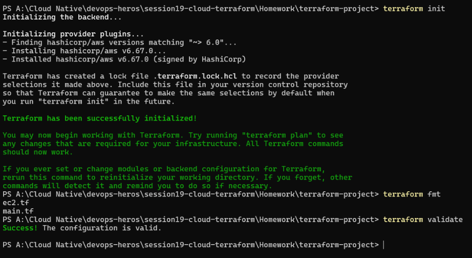
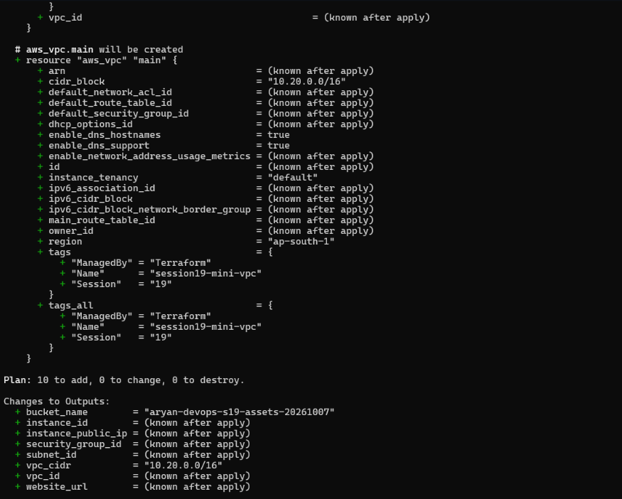
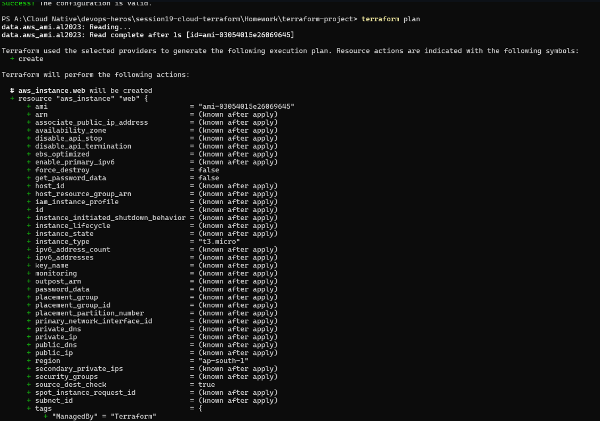
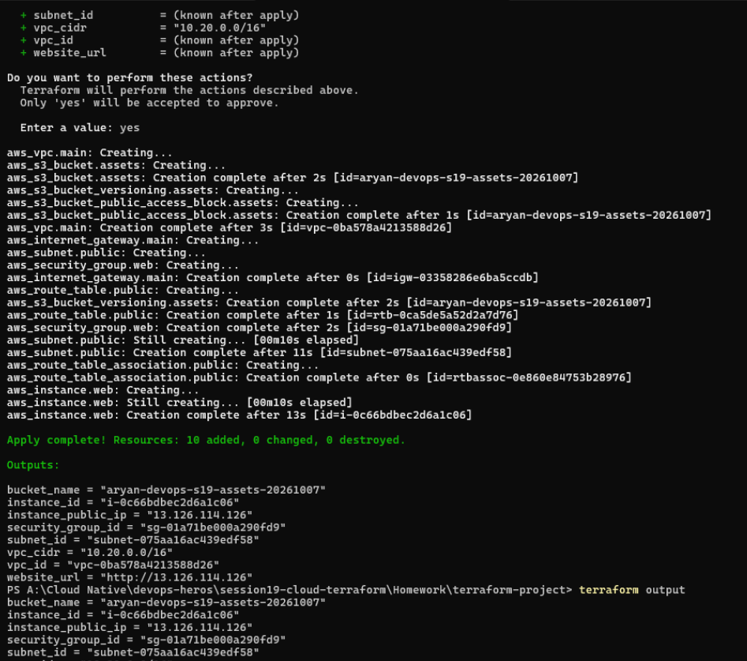
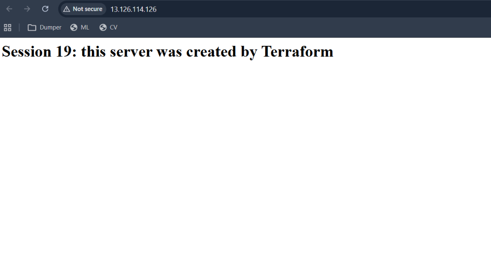
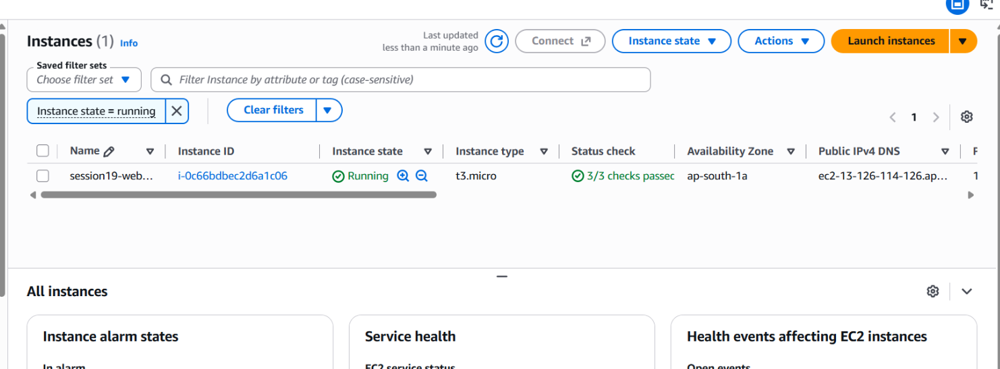
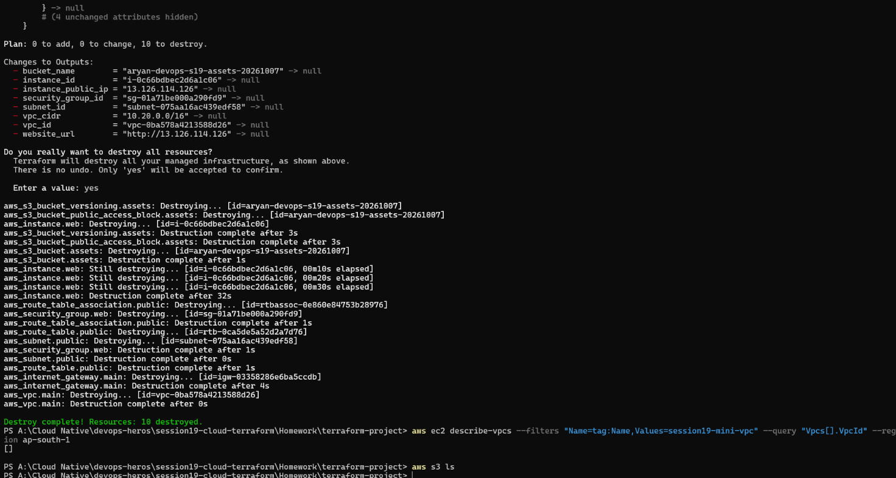

> `terraform init` installing `hashicorp/aws v6.67.0` and creating the lock file, `terraform fmt` printing `ec2.tf` and `main.tf` (files it reformatted), and `terraform validate` saying "Success! The configuration is valid."  
> This shows the project initialised and checked.  

> The end of `terraform plan`: `aws_vpc.main` with CIDR 10.20.0.0/16, DNS support and hostnames on, tags, then "Plan: 10 to add, 0 to change, 0 to destroy" and the outputs (bucket name, instance id, IP, subnet, vpc, website URL).  
> This shows what Terraform will create.  

> The start of `terraform plan`: the `aws_ami.al2023` data source is read, and `aws_instance.web` will be created (`t3.micro`, `ap-south-1`).  
> This shows the EC2 instance in the plan.  

> After `yes`, the apply log creating the VPC, S3 bucket, versioning, public access block, internet gateway, subnet, security group, route table and EC2 instance, then "Apply complete! Resources: 10 added" with the outputs and `terraform output`.  
> This shows the infrastructure being built.  

> Browser at the instance's public IP (marked "Not secure") showing "Session 19: this server was created by Terraform".  
> This shows the web server works.  

> AWS EC2 console with one instance filtered by state = running: `t3.micro`, `Running`, status checks 3/3 passed, availability zone ap-south-1a.  
> This shows the instance exists in AWS.  

> `terraform destroy` plan (10 to destroy), `yes`, the destroy log (instance took 32s) and "Destroy complete! Resources: 10 destroyed". `aws ec2 describe-vpcs` with the tag filter prints `[]` and `aws s3 ls` prints nothing.  
> This shows everything was removed.  
