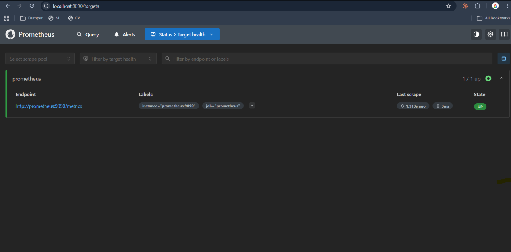
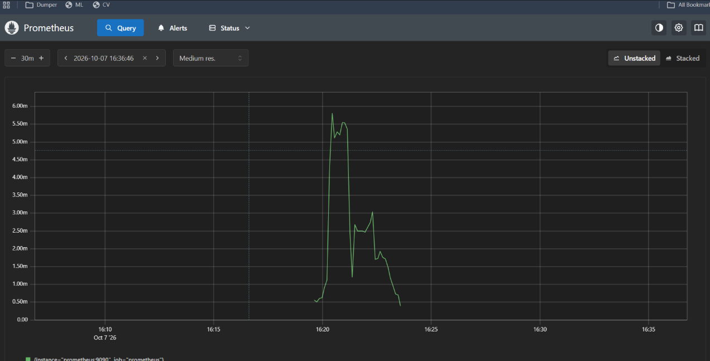
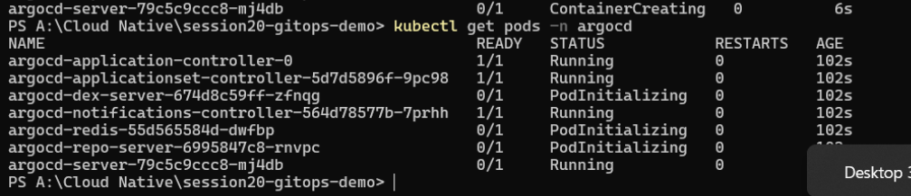
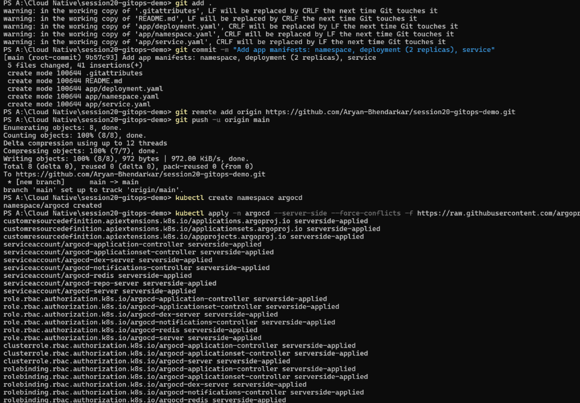
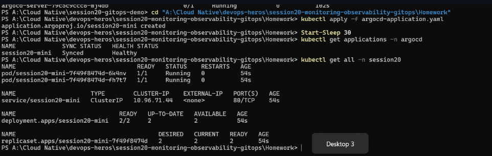
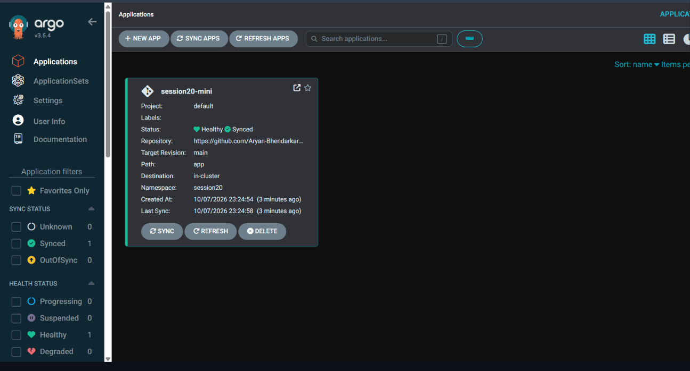

> Prometheus `localhost:9090/targets`: the `prometheus` job with `http://prometheus:9090/metrics`, state UP, "1 / 1 up", last scrape 1.9s ago.  
> This shows Prometheus is scraping itself.  

> Prometheus Query page graph for the last 30 minutes (ending 16:36:46): a green line for `instance="prometheus:9090"` that rises to about 6m and falls back below 1m.  
> This shows a metric graphed over time.  

> `kubectl get pods -n argocd` after installing Argo CD: application-controller, applicationset-controller and notifications-controller are `1/1 Running`; dex-server, redis and repo-server are `PodInitializing`; `argocd-server` is `0/1 Running`.  
> This shows Argo CD still starting up.  

> `git commit` of the app manifests (namespace, 2-replica deployment, service), `git remote add origin`, `git push -u origin main`, `kubectl create namespace argocd`, and `kubectl apply --server-side -f` of the Argo CD install manifest with its list of applied resources.  
> This shows my GitOps repo being pushed and Argo CD installed.  

> `kubectl apply -f argocd-application.yaml` (`session20-mini` created), `kubectl get applications -n argocd` showing `Synced` and `Healthy`, and `kubectl get all -n session20` with 2 pods, service, deployment `2/2` and ReplicaSet.  
> This shows Argo CD deployed my manifests from Git.  

> Argo CD web UI (v3.5.4) with the application card `session20-mini`: Healthy and Synced, path `app`, target revision `main`, destination in-cluster, namespace `session20`.  
> This shows the same result in the UI.  
