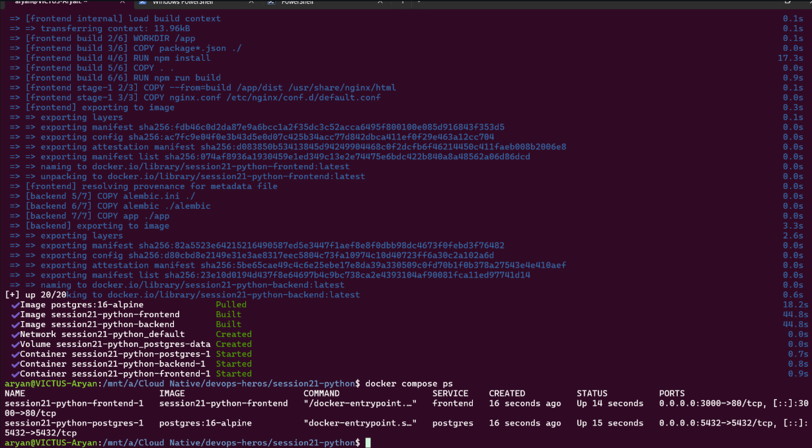
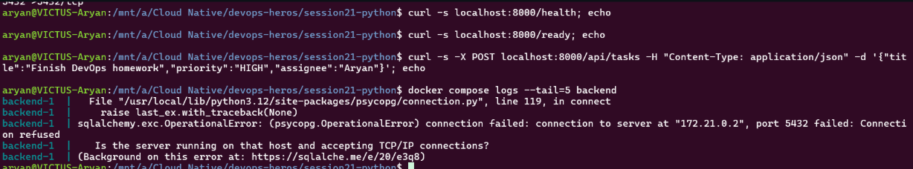
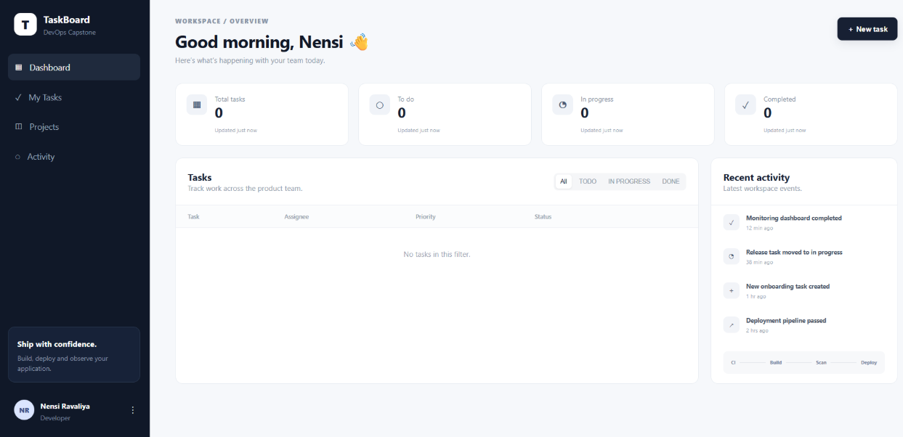
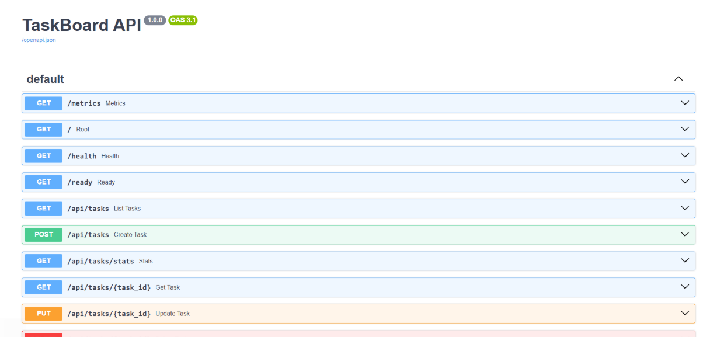

> `docker compose up` build output for the frontend and backend, then a summary: postgres image pulled, frontend and backend images built, network, volume and three containers started. `docker compose ps` lists only `frontend-1` and `postgres-1`.  
> This shows the stack starting, with the backend missing from `ps`.  

> `curl` on `localhost:8000/health`, `/ready` and a POST to `/api/tasks` print nothing, and `docker compose logs --tail=5 backend` ends with `sqlalchemy.exc.OperationalError ... connection to server at "172.21.0.2", port 5432 failed: Connection refused`.  
> This shows why the backend is down: it could not reach Postgres.  

> TaskBoard dashboard in the browser with Total/To do/In progress/Completed all 0 and "No tasks in this filter" under Tasks.  
> This shows the frontend loads but has no data.  

> TaskBoard API Swagger page (v1.0.0, OAS 3.1) listing `GET /metrics`, `/`, `/health`, `/ready`, `GET` and `POST /api/tasks`, `GET /api/tasks/stats`, `GET` and `PUT /api/tasks/{task_id}`.  
> This shows the backend's endpoints.  
