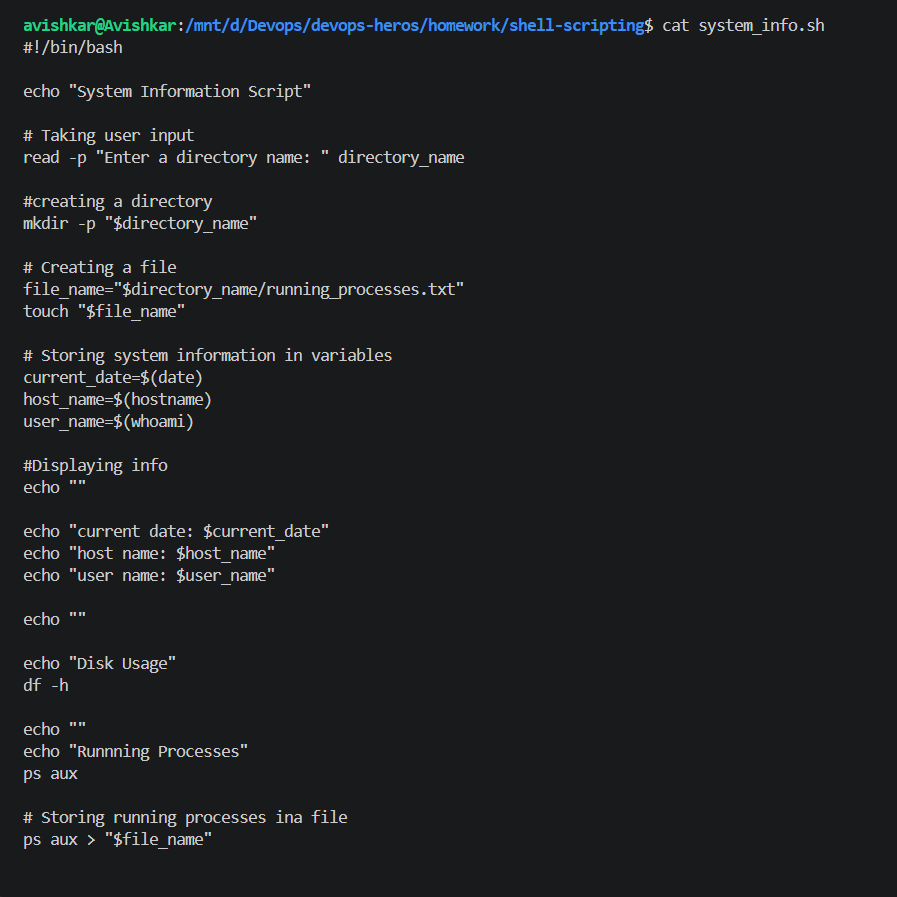
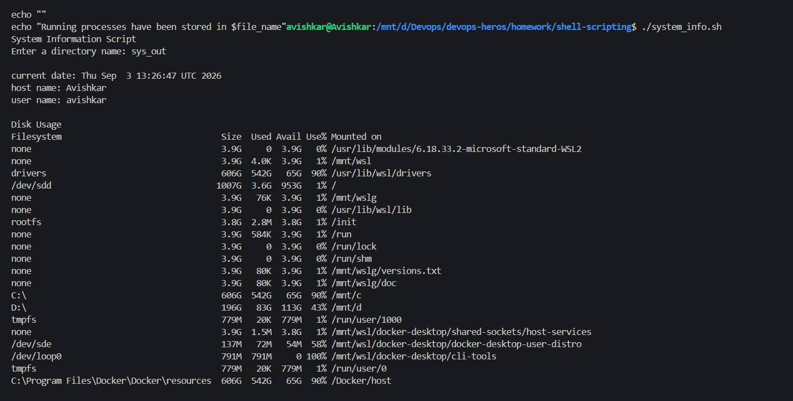
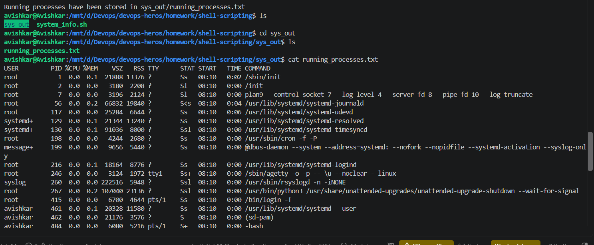

# Shell Scripting

I created a shell script to collect and display basic system information. The script uses the date command to get the current date, hostname to display the system hostname, and whoami to find the currently logged-in user. I stored these values in variables and used echo to display them in the terminal. The script also uses df -h to show disk usage in a human-readable format and ps aux to display the currently running processes.

The script takes input from the user using read -p. Here, read is used to accept input, while the -p option is used to display a prompt message before taking the input. The entered directory name is stored in a variable and then used with mkdir -p to create a directory. The -p option in mkdir allows the directory to be created without showing an error if it already exists, and it can also create parent directories when required. A file is then created inside the directory using touch. Finally, the output of ps aux is stored in this file using > output redirection. The > operator redirects the command output to the file instead of displaying it only on the terminal.

> `cat system_info.sh`: the script reads a directory name with `read -p`, makes it with `mkdir -p`, `touch`es `running_processes.txt`, stores `date`, `hostname` and `whoami` in variables, and then prints `df -h` and `ps aux`.  
> This is the source code of the script.  

> The last lines of the script, then `./system_info.sh` running. I typed `sys_out` at the prompt and it printed the date, host name (Avishkar), user name and the `df -h` disk usage table.  
> This shows variables, user input and command output in one script.  

> The end of the `df -h` table and the "Runnning Processes" heading (typo in my script) with the `ps aux` list.  
> This shows the process listing the script prints to the terminal.  

> The script's last message, then `ls`, `cd sys_out`, `ls` (shows `running_processes.txt`) and `cat running_processes.txt` with the same `ps aux` list.  
> This shows that `>` redirection saved the output to a file inside the directory I typed.  
