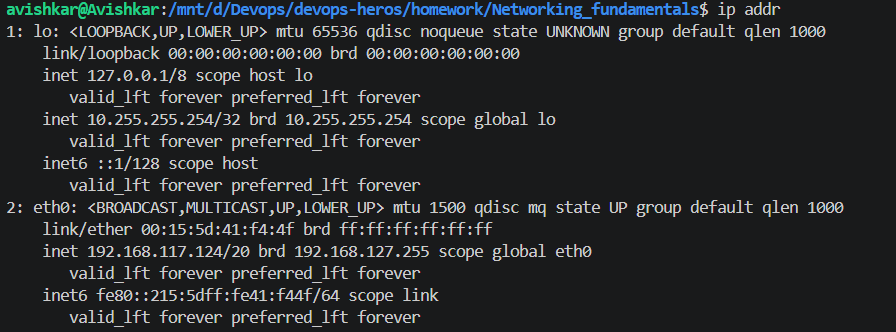
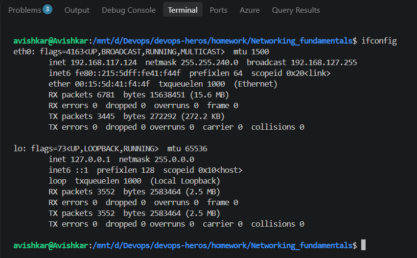
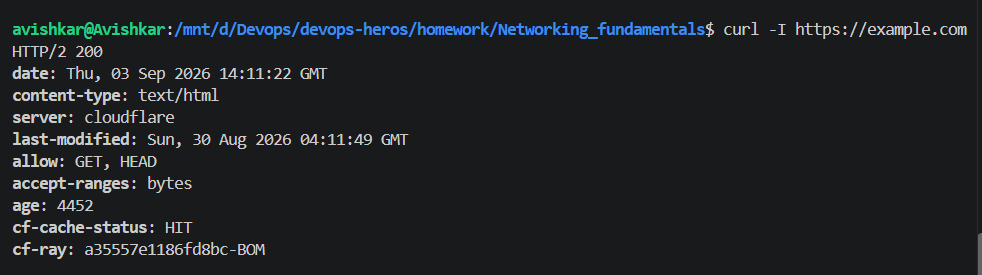
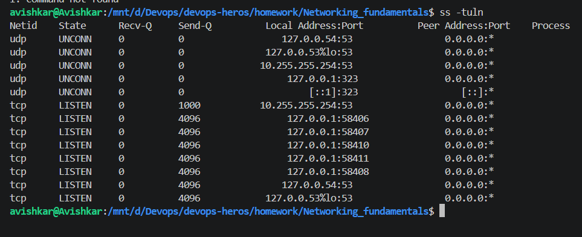
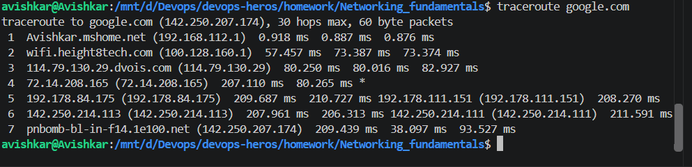
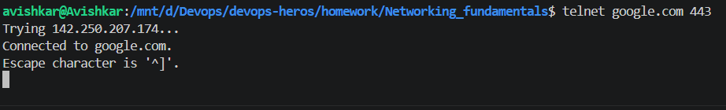

# Networking Fundamentals

I used ip addr to view the network interfaces and IP addresses configured on my system. It shows details such as the interface name, IPv4 and IPv6 addresses, and the current status of the interfaces.

> `ip addr` listing `lo` (127.0.0.1/8) and `eth0` (192.168.117.124/20, MAC 00:15:5d:41:f4:4f) with IPv6 addresses.  
> This shows the interfaces and IPs of my machine.  
> **What I understood:** `ip addr` lists every network interface with its IP addresses. `eth0` is my real network link and `lo` is the loopback used for talking to myself.

----
I used ifconfig to check the configuration of the network interfaces. It displays information such as IP addresses, MAC addresses, and network traffic statistics.

> `ifconfig` showing `eth0` and `lo` with the same IPs, netmask 255.255.240.0, MAC address, and RX/TX packet and byte counters with 0 errors.  
> This shows the older tool giving the same information plus traffic statistics.  
> **What I understood:** `ifconfig` shows the same interface info as `ip addr` but also the traffic counters. Errors and drops of 0 mean the link is healthy.

----

I used ping -c 4 google.com to test network connectivity. The -c 4 option sends four packets and then stops automatically. The output shows whether the destination is reachable, along with response times and packet loss.

> `ping -c 4 google.com` resolving to 142.250.206.110, four replies of 16 to 88 ms, and "4 packets transmitted, 4 received, 0% packet loss".  
> This shows google.com is reachable and how fast.  
> **What I understood:** `ping` sends ICMP echo packets and measures the round trip. `-c 4` makes it stop after four, and 0% loss means the connection is stable.

----

I used nslookup google.com to query the DNS information for a domain. It helped me see how the domain name is resolved to an IP address by a DNS server.

> `nslookup google.com` with server 10.255.255.254 and a non-authoritative answer with an IPv4 address (142.250.207.174) and an IPv6 address.  
> This shows DNS turning a name into IPs.  
> **What I understood:** `nslookup` asks a DNS server for the IP of a name. The "non-authoritative" answer means my DNS server gave a cached answer and not the domain's own server.

----

I used curl to send an HTTP request to a web server. The -I option requests only the response headers, which allowed me to check information such as the HTTP status code and server response headers.

> `curl -I https://example.com` returning `HTTP/2 200`, `content-type: text/html`, `server: cloudflare` and cache headers.  
> This shows the HTTP status and headers without the page body.  
> **What I understood:** `curl -I` only fetches the headers. The 200 status means the request worked and the server is Cloudflare.

----

I used ss -tuln to view the TCP and UDP ports that are currently listening on my system. The options -t and -u show TCP and UDP sockets, -l shows listening ports, and -n displays port numbers without resolving service names.

> `ss -tuln` listing UDP and TCP sockets: UDP 53 and 323, and TCP LISTEN entries on 127.0.0.1 (ports 58406 to 58411) and port 53.  
> This shows which ports are open on this machine.  
> **What I understood:** `ss` shows sockets. `-t` TCP, `-u` UDP, `-l` only listening, `-n` numbers. 127.0.0.1 means only local programs can connect, and port 53 is the DNS service.

----

I used traceroute google.com to trace the path taken by network packets from my system to the destination. Each line in the output represents a network hop between my system and the destination.

> `traceroute google.com` with 7 hops from my router (192.168.112.1) through my ISP to `pnbomb-bl-in-f14.1e100.net` (142.250.207.174). Hop 4 has a `*` for one probe.  
> This shows the path packets take to Google and the time at each hop.  
> **What I understood:** `traceroute` lists every router between me and the destination with the time for three probes. A `*` means that probe got no reply, and times jumping up show where the delay starts.

----

I used telnet google.com 443 to test connectivity to a specific port on a remote server. This command attempts to establish a connection to the specified host and port, which can be useful for checking whether a network service is reachable.

> `telnet google.com 443` printing "Trying 142.250.207.174...", "Connected to google.com." and "Escape character is '^]'." with a blinking cursor.  
> This shows port 443 on Google accepts a TCP connection.  
> **What I understood:** `telnet` just opens a TCP connection to a host and port. Getting "Connected" means the port is open and reachable, even though I did not send any request.
