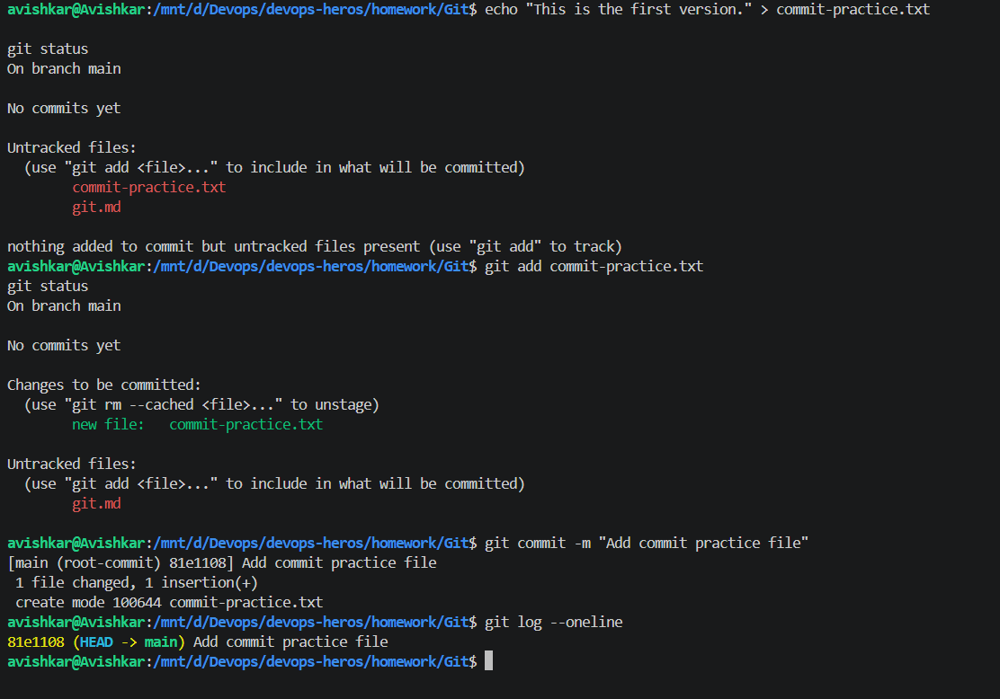
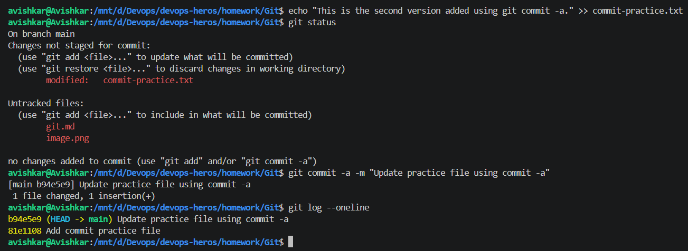
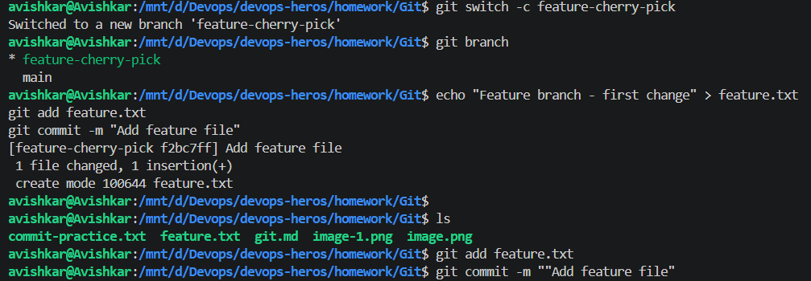
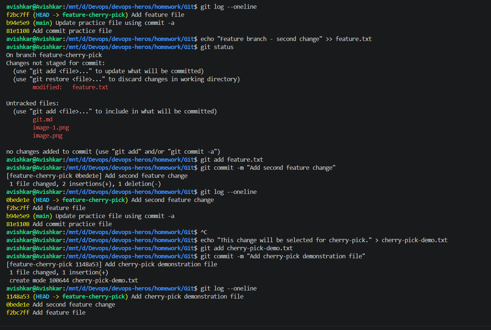
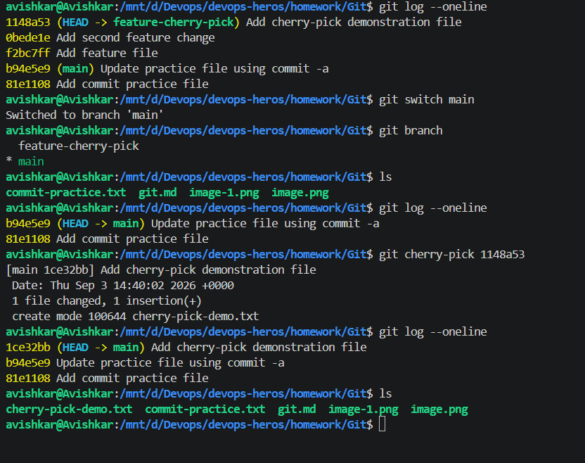

# Git

I first made two commits on the main branch. After that, I created a new branch called feature-cherry-pick and made three more commits there. I used git log --oneline to see all the commits and their commit IDs.

I then chose the commit 1148a53, which added cherry-pick-demo.txt. I switched back to the main branch and ran:

git cherry-pick 1148a53

This brought only that particular commit and its changes into main. I checked the result using git log, ls, and cat cherry-pick-demo.txt to make sure the file was added successfully.

> `git status` (untracked files), `git add commit-practice.txt`, `git status` again (new file staged), `git commit -m "Add commit practice file"` and `git log --oneline` showing the first commit `81e1108`.  
> This shows the add > commit flow.  

> I appended a line to `commit-practice.txt`; `git status` shows it as modified. `git commit -a -m` commits it without `git add`, and the log shows two commits (`b94e5e9`, `81e1108`).  
> This shows `commit -a` for tracked files.  

> `git switch -c feature-cherry-pick`, `git branch`, then `feature.txt` created, added and committed as `f2bc7ff`. A later commit command has extra quotes (`""Add feature file"`).  
> This shows creating a branch and committing on it.  

> `git log --oneline` with `f2bc7ff` on the feature branch and `b94e5e9` on main. Then a second change to `feature.txt` (commit `0bede1e`) and `cherry-pick-demo.txt` (commit `1148a53`).  
> This shows the extra commits on the feature branch and the one I will cherry-pick.  

> On the feature branch the log shows 5 commits. After `git switch main`, `git cherry-pick 1148a53` creates `1ce32bb` on main and `ls` now has `cherry-pick-demo.txt`; the other feature commits are not on main.  
> This shows cherry-pick copying just one commit.  
