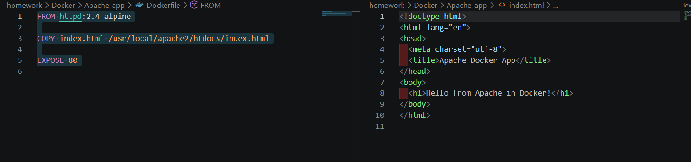
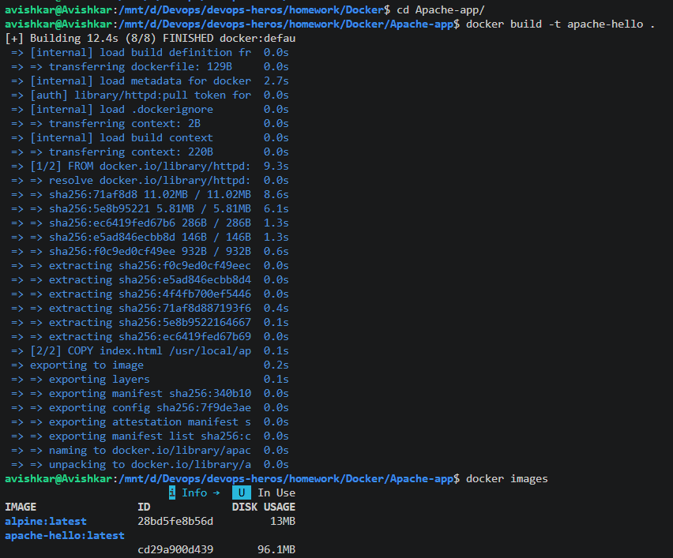
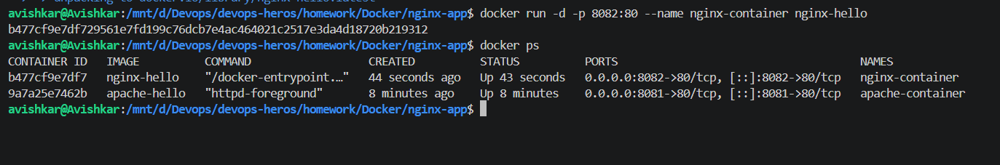
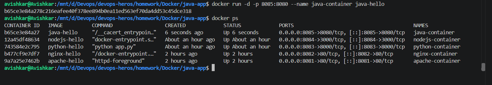
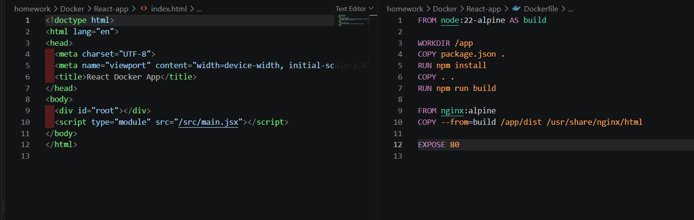
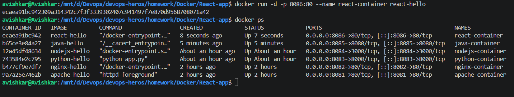

# Apache-app

> VS Code split view: the Apache `Dockerfile` (`FROM httpd:2.4-alpine`, `COPY index.html ...`, `EXPOSE 80`) and `index.html` with "Hello from Apache in Docker!".  
> This shows the files for the Apache app.  

> `docker build -t apache-hello .` finishing (8/8 steps, 12.4s) and `docker images` listing `apache-hello:latest` (96.1MB) and `alpine:latest`.  
> This shows the image was built.  

> `docker run -d -p 8081:80 --name apache-container apache-hello` and `docker ps` showing the container Up with `0.0.0.0:8081->80/tcp`.  
> This shows the Apache container running on host port 8081.  

# nginx-app

> The nginx `Dockerfile` (`FROM nginx:alpine`, copy to `/usr/share/nginx/html`, `EXPOSE 80`) next to its `index.html` ("Hello from nginx in Docker!").  
> This shows the files for the nginx app.  

> `docker run -d -p 8082:80 --name nginx-container nginx-hello` and `docker ps` listing `nginx-container` (8082) and `apache-container` (8081).  
> This shows two containers running side by side on different ports.  

# python-app

> `app.py` (a small `HTTPServer` returning "Hello from Python in Docker!" on port 8000) and its `Dockerfile` (`python:3.13-slim`, `WORKDIR /app`, `CMD ["python", "app.py"]`).  
> This shows the files for the Python app.  

> `docker run -d -p 8083:8000 --name python-container python-hello` and `docker ps` showing three containers (python 8083, nginx 8082, apache 8081).  
> This shows the Python app running.  

# nodejs-app

> `app.js` (Node `http` server answering "Hello from Node.js in Docker!" on port 3000) and its `Dockerfile` (`node:22-alpine`).  
> This shows the files for the Node.js app.  

> `docker run -d -p 8084:3000 --name nodejs-container nodejs-hello` and `docker ps` showing four containers.  
> This shows the Node.js app running on host port 8084.  

# java-app

> `HelloWorld.java` (an `HttpServer` on port 8080 returning an `<h1>` message) and its `Dockerfile` (`eclipse-temurin:21-jdk-alpine`, `RUN javac --add-modules jdk.httpserver`, `CMD java ...`).  
> This shows the files for the Java app.  

> `docker run -d -p 8085:8080 --name java-container java-hello` and `docker ps` showing five containers.  
> This shows the Java app running on host port 8085.  

# React-app

> React `index.html` (a `div id="root"` and a module script) and a two-stage `Dockerfile`: build with `node:22-alpine` (`npm install`, `npm run build`), then `COPY --from=build /app/dist` into `nginx:alpine`.  
> This shows the files for the React app.  

> `docker run -d -p 8086:80 --name react-container react-hello` and `docker ps` showing all six containers (ports 8081 to 8086).  
> This shows the React app running.  
