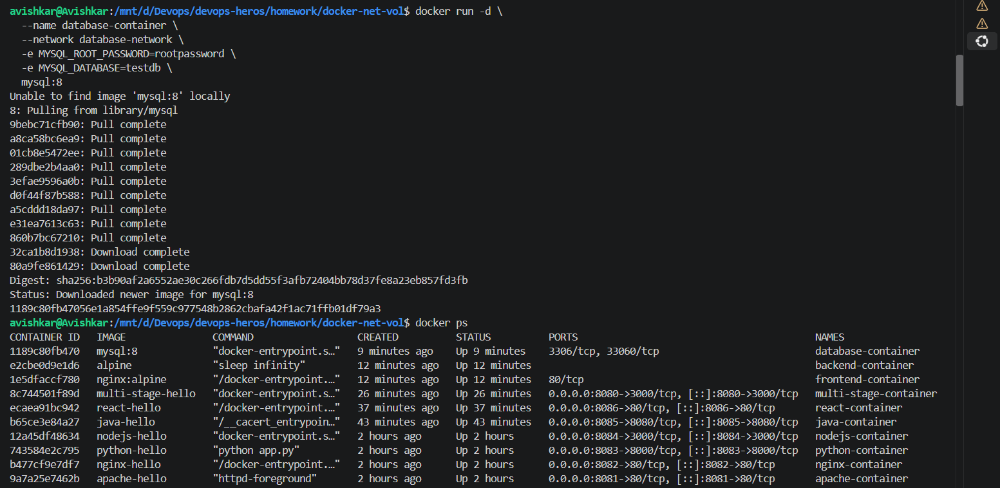
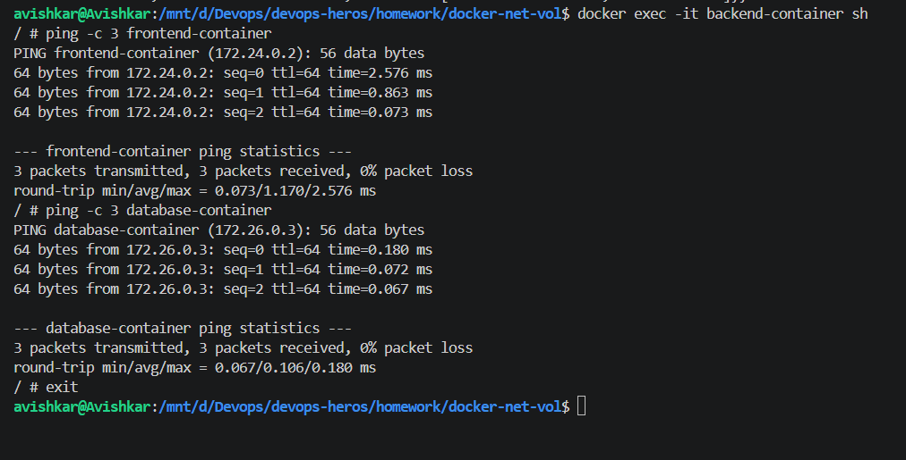
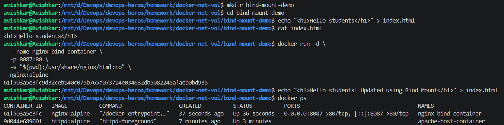

# Task 1: Docker Container Networking

> Creating three networks with `docker network create`, `docker network ls` listing them, then running `frontend-container` (nginx) and `backend-container` (alpine, `sleep infinity`) on `frontend-network`, and connecting the backend to `backend-network` and `database-network`.  
> This shows the backend attached to three networks.  

> `docker run` for `database-container` (mysql:8 on `database-network`, with root password and `testdb` set by `-e`) pulling the image, then `docker ps` listing the database, backend and frontend containers.  
> This shows the three containers running.  

> The first part of `docker inspect backend-container`: State `running`, `Path: sleep`, `Args: infinity`, and the log and hosts paths.  
> This is the start of the inspect JSON.  

> The Networks part of the inspect output: `database-network` with IP 172.26.0.2 and `frontend-network` with IP 172.24.0.3, each with its own gateway and DNS names.  
> This proves the backend is on two separate networks.  

> `docker exec -it backend-container sh`, then `ping -c 3 frontend-container` (172.24.0.2) and `ping -c 3 database-container` (172.26.0.3), both with 0% packet loss.  
> This shows container names resolve and the backend can reach both containers.  

# Task 2: Host Network

> `docker pull httpd:alpine` and `docker run -d --name apache-host-container --network host httpd:alpine`, which prints a container ID.  
> This shows starting a container on the host network.  

> `docker start apache-host-container`, `docker ps` (the PORTS column is empty) and `curl http://localhost:80` returning the Apache "It works!" page.  
> This shows the container shares the host's network, so no `-p` is needed.  

# Task 3: Bind Mount

> `bind-mount-demo` folder with `index.html` ("Hello students"), then `docker run ... -p 8087:80 -v "$(pwd)":/usr/share/nginx/html:ro nginx:alpine`. I edited `index.html` with `echo` and `docker ps` shows `nginx-bind-container`.  
> This shows a bind mount from a host folder.  

> Browser at `localhost:8087` showing "Hello students".  
> This is the page served from the mounted folder.  

> The same `localhost:8087` page after refresh, now "Hello students! Updated using Bind Mount".  
> This shows the container sees the edited file without a rebuild.  

## Task 4: Overlay Network

An overlay network is a Docker network that allows containers running on different Docker hosts to communicate with each other. Unlike a bridge network, which is mainly used for containers on the same host, an overlay network is designed for distributed environments.

Overlay networks are commonly used with Docker Swarm and are useful when an application is deployed across multiple servers. For example, a frontend container running on one server can communicate with a backend container running on another server through the same overlay network.

This type of network is useful for microservices and distributed applications where containers need secure communication across multiple Docker hosts.
